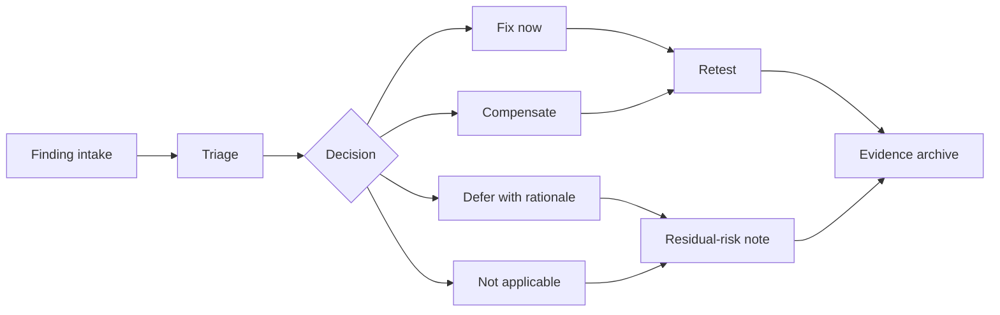

# CDE 2026 BreezyVoice Full Transcript Source For TTS Expert

Status: source package for expert rewriting; not model-ready as-is.

Purpose: collect Jason front-half source, Jingzhong back-half text, and shared close source in one reviewable file.

## Part 1 - Opening And Jason Front-Half Source

### Slide 1 - Cover

- Title: `臨床端對醫療器材 / 資訊系統之資安要求`
- Subtitle: `Clinical Cybersecurity Requirements for Medical Devices and Healthcare Information Systems`
- Purpose: establish formality, medical context, infrastructure feeling, and cybersecurity topic without making the talk look like a hacker presentation.
- Visual: deep-blue background with hospital information-system silhouettes, PACS / HIS / EMR / connected-device nodes, or a subtle network overlay.
- Footer: CDE, TFDA, NYCU, date, Prof. Wu.
- Avoid: hoodie hacker, binary rain, skull, dramatic dark-web imagery.
- Speaker line: `今天不只是談 regulation，而是談醫院真正怎麼面對醫療系統與醫療器材的資安風險。`

### Slide 2 - Speaker And Team Credibility

- Title: `From Medical AI Development to Cybersecurity Practice`
- Purpose: establish `這群人真的做過`, not a pure regulatory lecture.
- Layout: left side for Prof. Wu, right side for team capability matrix.
- Left content: NYCU, 生醫光電, 醫療 AI / SaMD, clinical systems, FDA `510(k)` experience.
- Right content: medical software, clinical workflow, cybersecurity testing, deployment governance, regulatory evidence.
- Bottom line: `Experience from medical-device development, AI systems, deployment, and cybersecurity operations.`
- Credibility placement: possible soft reference to 智得灣 / 智德萬 or Wu-team experience, but do not turn it into a company brochure.
- Avoid: product catalog, `contact us`, sales channel, crowded logo wall.

### Slide 3 - This Talk Is About Operational Reality

- Title: `This Talk Is About Clinical Cybersecurity in Practice`
- Core message: cybersecurity requirements finally land in hospital operations, device deployment, maintenance workflow, and responsibility assignment.
- Layout: left/right contrast.
- Left: regulation-only view: statutes, checklist, document submission.
- Right: clinical operation view: clinical continuity, maintainable devices, traceable vulnerabilities, repair evidence, risk ownership.
- Bottom takeaway: `Medical cybersecurity now affects clinical continuity and patient safety.`
- Speaker line: `法規是起點，真正的挑戰是如何在醫院端落地。`

### Slide 4 - Today's Story Map

- Title: `Today's Story Map`
- Purpose: tell the audience this is one lifecycle story, not disconnected topics.
- Visual: horizontal journey: `醫院現實 -> FDA 為何改變 -> 攻擊面 -> 測試與治理 -> 白箱與系統設計 -> 證據鏈`.
- Node writing:
  - Hospital reality: 醫院不是普通 IT 環境.
  - Regulatory shift: 醫療器材已變成 connected systems.
  - Attack surface: 攻擊面存在於 workflow.
  - Testing: 測試要連到臨床衝擊.
  - Engineering: 系統設計要能防錯.
  - Evidence: 最後要留下可稽核證據.
- Speaker line: `今天不是零散 topic，而是一條完整 lifecycle。`

### Slide 5 - Where This Session Fits

- Title: `Where This Session Fits`
- Purpose: avoid overlap with the two earlier CDE talks.
- Visual: three-column table.
- Content:
  - 第一場 / 驗證單位 / 驗證要求與常見缺失.
  - 第二場 / 醫材業者 / 設計驗證經驗.
  - 第三場 / 臨床端 / 醫院部署、使用、維護與資安要求.
- Speaker line: `前兩場偏驗證與廠商設計，本場會從醫院端與臨床使用端看問題。`
- Writing caution: keep this brief; it is a positioning slide, not agenda bureaucracy.

### Slide 6 - Hospitals Are Critical Infrastructure

- Title: `Hospitals Are Critical Infrastructure`
- Core message: hospital cybersecurity incidents affect care continuity.
- Visual: event chain: `Ransomware -> PACS unavailable -> imaging delay -> treatment delay -> patient safety risk`.
- Supporting points: healthcare services cannot stop casually; unavailable data affects diagnosis; system delay becomes clinical delay.
- Speaker line: `真正問題不是檔案加密，而是醫療流程中斷。`

### Slide 7 - A Hospital Is A System Of Systems

- Title: `A Hospital Is a System of Systems`
- Purpose: let the audience see the real interconnected environment before attack paths appear.
- Visual: large architecture diagram with HIS, EMR, PACS, LIS, nurse station, radiology workstation, identity system / AD, vendor VPN, medical devices, cloud service, and clinical users.
- Bottom takeaway: `任何一個連接點，都可能成為風險傳遞路徑。`
- Design caution: do not make the diagram too technical; it must communicate interconnectedness at a glance.

### Slide 8 - Clinical Network Boundaries Matter

- Title: `Clinical Network Boundaries Matter`
- Purpose: create the reference map for later attack chains.
- Visual: zone diagram: Internet, DMZ, admin network, clinical network, imaging network, lab network, device subnet, vendor maintenance access.
- Highlight: trust boundaries with red dashed lines.
- Speaker line: `很多攻擊不是直接打醫材，而是先進入醫院 network，再橫向移動。`
- Credibility placement: this page should feel like it came from real deployment review.

### Slide 9 - Why "Just Patch It" Often Fails In Hospitals

- Title: `Why "Just Patch It" Often Fails in Hospitals`
- Core message: patching in hospitals is governance, not a button.
- Visual: four cards: clinical uptime, vendor validation, compatibility testing, regulatory / validation constraints.
- Supporting points: devices may support care now; updates may require vendor confirmation; HIS / PACS / device compatibility matters; downtime windows are limited.
- Bottom takeaway: `Patch 在醫院是一個治理流程，不是一個按鈕。`
- Speaker note: this is a high-resonance hospital-side slide.

### Slide 10 - Legacy Systems Are Still Part Of Clinical Reality

- Title: `Legacy Systems Are Still Part of Clinical Reality`
- Core message: medical-device lifecycle is often much longer than normal IT lifecycle.
- Visual: old workstation / embedded device plus medical-device lifecycle timeline.
- Supporting points: long device life, expired operating system, limited vendor support, replacement cost, clinical revalidation difficulty.
- Tone: do not blame hospitals; explain structural constraints.

### Slide 11 - Vendor Access Is A Trust Boundary

- Title: `Vendor Access Is a Trust Boundary`
- Core message: vendor remote maintenance is necessary but risky.
- Visual: `Vendor laptop -> VPN -> Hospital network -> Medical device subnet`.
- Supporting points: remote maintenance accounts, VPN privileges, shared credentials, outsourced operations, vendor endpoint risk.
- Bottom takeaway: `被信任的維護路徑，也可能成為攻擊路徑。`
- Credibility placement: this naturally signals deployment experience.

### Slide 12 - PACS Downtime Becomes Clinical Delay

- Title: `PACS Downtime Becomes Clinical Delay`
- Purpose: turn abstract cybersecurity into clinical scenario.
- Visual: patient -> CT / MRI -> PACS -> physician review -> diagnosis -> treatment.
- Supporting points: imaging unavailable, diagnosis delayed, surgery / ER workflows affected, workaround pressure on physicians.
- Speaker line: `這不是單純系統壞掉，而是診斷流程被迫中斷。`

### Slide 13 - Cybersecurity Is Patient Safety

- Title: `Cybersecurity Is Patient Safety`
- Purpose: first emotional anchor and transition to regulation.
- Visual: `IT failure -> Clinical workflow disruption -> Patient safety risk`.
- Supporting points: confidentiality protects records/images; integrity prevents unsafe data modification; availability keeps clinical systems usable.
- Bottom takeaway: `醫療資安的終點，是照護不中斷。`

### Slide 14 - Medical Devices Became Networked Computers

- Title: `Medical Devices Became Networked Computers`
- Purpose: explain why FDA / TFDA cybersecurity requirements became inevitable.
- Visual: timeline: standalone device -> networked device -> cloud-connected device -> AI-enabled SaMD.
- Supporting points: connected, updatable, data-exchanging, remotely maintained, integrated with hospital systems.
- Speaker line: `FDA / TFDA 開始重視 cybersecurity，是因為醫材已經不再只是單機設備。`

### Slide 15 - Why FDA Cybersecurity Requirements Expanded

- Title: `Why FDA Cybersecurity Requirements Expanded`
- Visual: four drivers around FDA: ransomware threat, connected devices, third-party components, postmarket vulnerabilities.
- Core message: FDA cares about the full product lifecycle, not just one premarket test.
- Writing caution: no legal-wall text; use risk logic.

### Slide 16 - FDA 524B In Plain Language

- Title: `FDA 524B in Plain Language`
- Purpose: introduce the regulation without reading the statute.
- Visual: four blocks: secure updates, SBOM, vulnerability disclosure, postmarket support.
- Writing approach: each block gets one operational sentence.
- Example sentence: `產品上市後，仍需有能力處理新發現的弱點。`
- Speaker line: `FDA 已經把 cybersecurity 視為 product lifecycle 問題。`

### Slide 17 - Secure Product Development Framework

- Title: `Secure Product Development Framework`
- Purpose: place cybersecurity inside development flow.
- Visual: lifecycle loop: design -> threat model -> implement -> test -> release -> monitor -> patch -> retest.
- Supporting points: security cannot be added only at the end; testing must map to risk; patching needs process; evidence must remain traceable.

### Slide 18 - SBOM Is A Map Of Responsibility

- Title: `SBOM Is a Map of Responsibility`
- Core message: SBOM is not just a definition or inventory.
- Visual: dependency tree: product -> library A -> library B -> container base image -> OS package.
- Supporting points: what components are used; which components have vulnerabilities; who tracks them; who repairs them; what compensating controls are used when repair is not possible.
- Speaker line: `真正問題不是有沒有 SBOM，而是出了漏洞之後誰負責。`
- Credibility placement: this is a practical industry pain point.

### Slide 19 - Coordinated Vulnerability Disclosure

- Title: `Coordinated Vulnerability Disclosure`
- Purpose: explain postmarket vulnerability-handling workflow.
- Visual: report -> validate -> risk assess -> fix -> notify -> retest -> archive.
- Supporting points: receive report; validate authenticity; assess clinical impact; decide fix; notify users; preserve evidence.
- Tone: governance workflow, not PR statement.

### Slide 20 - Regulators And Hospitals Need Evidence

- Title: `Regulators and Hospitals Need Evidence`
- Purpose: transition from FDA lifecycle to attack surface and testing.
- Visual: evidence chain: design evidence -> testing evidence -> deployment evidence -> patch evidence -> retest evidence.
- Bottom takeaway: `信任不是口頭承諾，而是可被檢查的證據鏈。`

### Slide 21 - Clinical Attack Surface Map

- Title: `Clinical Attack Surface Map`
- Purpose: formally start Jason's main section.
- Visual: clinical workflow in the center; attack surfaces around it: identity, workstation, network, vendor VPN, PACS, DICOM, HL7 / API, update server, third-party dependency, medical IoT.
- Core message: attack surface is not a single device; it is data, accounts, network, maintenance, and update workflow.
- Speaker line: `真正 attack surface 是整個 workflow。`

### Slide 22 - Attack Path 1: Phishing To Clinical Systems

- Title: `Attack Path 1: Phishing to Clinical Systems`
- Visual: red chain: phishing email -> workstation -> credential theft -> AD access -> lateral movement -> HIS / PACS disruption.
- Supporting points: initial entry may be ordinary; downstream impact may be clinical; lateral movement matters in healthcare.
- Speaker line: `醫療系統的風險常常不是從醫療設備開始，而是從一般工作站開始。`
- Caution: no exploit steps.

### Slide 23 - Attack Path 2: Vendor VPN To Device Subnet

- Title: `Attack Path 2: Vendor VPN to Device Subnet`
- Visual: vendor -> VPN -> privileged access -> device subnet -> medical-device disruption.
- Supporting points: vendor access needs least privilege; maintenance accounts need auditability; connection scope must be limited; sessions should be logged.
- Bottom takeaway: `遠端維護是必要功能，也是高風險入口。`
- Credibility placement: very strong; this feels like real hospital deployment.

### Slide 24 - Attack Path 3: PACS And DICOM Exposure

- Title: `Attack Path 3: PACS and DICOM Exposure`
- Visual: radiology modality -> DICOM router -> PACS -> viewer -> EMR.
- Supporting points: imaging systems are high value; DICOM workflows often include trust assumptions; image data is large and sensitive; downtime has high clinical impact.
- Caution: do not over-explain DICOM exploit mechanics.

### Slide 25 - Integration Interfaces Are Trust Boundaries

- Title: `Integration Interfaces Are Trust Boundaries`
- Visual: HIS / LIS / EMR / third-party systems with data-flow arrows.
- Supporting points: integration is not security; input validation must be explicit; API permissions need layering; file ingestion must validate format and source.
- Core message: interoperability creates new trust boundaries.

### Slide 26 - Third-Party Components Become Medical Risk

- Title: `Third-Party Components Become Medical Risk`
- Visual: stack: app -> framework -> package -> container -> OS -> hardware.
- Supporting points: risk may come from external libraries; transitive dependencies require tracking; container base images carry risk; vendor components require responsibility split.
- Speaker line: `很多風險不是自己寫的 code，而是第三方 component。`
- Credibility placement: use `實務上常看到 component ownership 不清楚` as a soft experience line.

### Slide 27 - Attack Path 4: Update Path As A High-Impact Boundary

- Title: `Attack Path 4: Update Path as a High-Impact Boundary`
- Visual: update server -> package signing -> device update -> deployment.
- Supporting points: update-server compromise can affect many devices; package integrity must be verified; rollback plan must exist; update logs must be traceable.
- Caution: explain consequence, not attack recipe.

### Slide 28 - Weak Credentials Plus Flat Network Equals Lateral Movement

- Title: `Weak Credentials + Flat Network = Lateral Movement`
- Visual: one account moving across multiple systems.
- Supporting points: shared admin account, reused password, weak segmentation, over-privileged service account.
- Bottom takeaway: `一個弱帳號，可能變成整個臨床網路的入口。`

### Slide 29 - Connected Devices Can Become Bridges

- Title: `Connected Devices Can Become Bridges`
- Visual: IoMT device as bridge between device subnet and hospital systems.
- Supporting points: a device is not only an endpoint; it may connect to cloud, vendor, and internal data flows.
- Caution: stay conceptual and avoid naming private systems.

### Slide 30 - Clinical Workflow Is The Attack Surface

- Title: `Clinical Workflow Is the Attack Surface`
- Purpose: summarize Jason's attack-chain section.
- Visual: patient registration -> imaging -> diagnosis -> treatment -> reporting -> follow-up, with attack paths overlaid.
- Supporting points: attack surface follows patient workflow, data workflow, identity workflow, and maintenance workflow.
- Bottom takeaway: `資安保護的不是單一設備，而是整個 connected care workflow。`

### Slide 31 - Scan, Black-Box Test, And Penetration Test Are Different

- Title: `Scan, Black-box Test, and Penetration Test Are Different`
- Visual: three-column comparison table.
- Content:
  - Vulnerability scan: finds known vulnerabilities and exposure; cannot prove realistic attack path.
  - Black-box test: sees externally visible behavior; cannot explain internal root cause.
  - Penetration test: validates exploitability and attack chain; cannot replace all code / system assurance.
- Speaker line: `測試方法不同，證明力也不同。`

### Slide 32 - Anatomy Of A Useful Security Finding

- Title: `Anatomy of a Useful Security Finding`
- Purpose: show what a useful report artifact looks like.
- Visual: finding report mockup.
- Fields: asset, entry point, evidence, attack path, clinical impact, severity rationale, owner, recommended fix, retest result, residual risk.
- Bottom takeaway: `好的 finding 不是只有漏洞名稱，而是能推動修補。`
- Credibility placement: report quality quietly sells service capability.

### Slide 33 - Severity Depends On Clinical Context

- Title: `Severity Depends on Clinical Context`
- Visual: same vulnerability in two contexts: administrative test system vs ER PACS viewer.
- Supporting points: CVSS is a starting point; exposure matters; clinical impact matters more; exploitability must be interpreted in context.
- Core message: same technical bug can have different medical risk.

### Slide 34 - Threat Modeling Connects Risk To Engineering

- Title: `Threat Modeling Connects Risk to Engineering`
- Purpose: Jason section close and handoff to 靖中.

## Part 1 Companion - Jason Content Spine

## Jason's 40-Minute Content Spine

### 1. Clinical-End Threat Model

Say this early:

`醫院端不是只問你的產品有沒有掃描過，而是問這個系統進到院內以後，誰能看見風險、誰能修、修多久、修完怎麼證明。`

Core points:

- Clinical continuity: cybersecurity incident can disrupt care, workflow, imaging, reporting, or device availability.
- Product scale changes evidence burden: model-only evidence is different from connected system evidence.
- Procurement evidence should be decision-usable: architecture, SBOM, threat model, test report, patch process, residual-risk language.

Hospital pain examples:

- ransomware causes outpatient / inpatient workflow disruption;
- PACS or imaging workflow outage blocks diagnosis and reporting;
- MRI, connected device, workstation, or vendor appliance becomes a lateral-movement bridge;
- legacy Windows / unsupported device cannot be patched on a normal IT schedule;
- vendor remote maintenance creates a privileged external trust path;
- hospital patch windows are constrained by clinical operation, validation, and vendor support.

Regulatory logic:

`FDA / TFDA 開始要求 cybersecurity，不是因為條文突然變多，而是醫材已經變成會連網、會更新、會和醫院系統交換資料的 computer。`

### 2. Penetration Testing / Black-Box Exposure

Frame:

`滲透測試不是找紅字，而是模擬一條攻擊路徑，確認這條路徑是否能造成臨床或營運上的重要影響。`

Explain:

- Black-box test: what is visible without internal access.
- Penetration test: realistic chain from entry point to impact.
- Medical context changes priority: the same technical bug can matter more if it blocks clinical workflow, leaks sensitive data, or enables unsafe configuration change.
- Useful report outputs: attack path, affected asset, clinical / operational impact, reproducible evidence, immediate mitigation, final fix, retest proof.

Concrete attack-path menu:

- phishing -> workstation -> AD / file share -> HIS / PACS access;
- VPN / remote maintenance -> vendor account -> device subnet;
- exposed web/API endpoint -> weak auth -> patient data or admin action;
- DICOM / HL7 / file ingestion -> parser / workflow abuse;
- vulnerable third-party package -> application compromise;
- update server / update package weakness -> unsafe deployment path.

Avoid:

- step-by-step exploit recipe;
- live attack detail;
- named private systems.

### 3. Governance After Findings

Frame:

`沒有 decision，就沒有治理；沒有證據，就沒有信任。`

Finding journey:

Governance checklist:

- owner assigned;
- severity and clinical context recorded;
- decision made: fix, compensate, defer, accept / not applicable;
- timeline / Patch SLA stated;
- hospital communication path known;
- retest evidence stored;
- residual risk written in language the clinical owner can understand.

Strategic placement:

- Do not say `智得灣 / 智德萬 可以賣你這個服務` as a hard pitch.
- Instead, show that each finding needs a real execution workflow: who finds it, who understands the clinical impact, who repairs it, who verifies it, and who can explain it to hospital / regulator stakeholders.
- Capability should be demonstrated by how concrete the workflow is.

## Part 2 - Handoff Bridge Draft

到這裡，我們已經把醫院端的 attack surface、測試方法、finding 結構，以及 threat modeling 的角色串起來。下一步要看的是：當外部測試已經告訴我們攻擊路徑可能存在，系統內部要如何證明根因、修補與部署條件都真的被控制。這就是後半段 white-box testing 與 system review 要處理的問題。

外部測試回答的是攻擊者可以做到什麼；白箱與系統審查要回答的是，這個風險為什麼存在、修補怎麼證明、部署後是否仍然成立。接下來我們進入後半段，從 white-box testing 談到 lifecycle evidence。

## Part 3 - Jingzhong Back-Half Clean Text

接下來我們進入今天後半段的重點，也就是 White-box Testing。
前面我們談了很多醫療資安的臨床衝擊，包括醫院系統中斷、影像流程停擺、廠商維護通道、修補困難，以及部署環境的治理問題。這些問題最後會回到一個核心：我們不能只知道外部看得到什麼弱點，我們還要知道這個弱點為什麼存在，以及它是否真的被控制。
所以這一段我想把白箱測試重新定位。白箱測試不是只有 source code review，也不是工程師自己看程式碼而已。對醫療裝置與醫療資訊系統來說，白箱測試更像是一條 evidence chain：從 threat model 開始，進入 code review，再產生 test evidence，接著完成 fix and retest，最後累積成 lifecycle trust。
也就是說，白箱測試的價值不只是找到漏洞，而是把漏洞背後的設計決策、實作細節、設定條件、部署環境、修補紀錄、重測結果全部串起來。
這也呼應 FDA 或醫療法規審查會關心的事情。審查者不只是問「你有沒有做測試」，而是會問：你的控制措施從哪裡來？跟哪個風險有關？程式裡是否真的有實作？部署後是否仍然有效？修補後是否有重測？剩餘風險是否有被接受？
所以這一頁可以用一句話帶過：White-box testing explains why a risk exists — and how to prove it is controlled.
白箱測試的目標不是製造更多文件，而是讓資安決策變成可以被驗證、可以被稽核、可以被追蹤的生命週期證據。
這一頁說明為什麼只做 outside-in testing 不夠。
外部測試，例如 black-box testing 或 penetration testing，通常回答的是：「攻擊者從外面可以看到什麼？可以連到什麼？可以觸發什麼？可以利用什麼？」這些測試非常重要，因為它們能證明 exploitability，也就是攻擊者是否真的可以走出一條攻擊路徑。
但是外部測試有一個限制：它通常只能看到現象，不一定能解釋根因。
例如，滲透測試發現某個 API 可以繞過權限檢查。這個結果很重要，但下一步我們還要問：為什麼可以繞過？是設計上沒有定義角色邊界？是程式裡缺少 authorization check？是 token 驗證邏輯錯誤？是 deployment 時把 debug endpoint 打開？還是某個 service account 權限過大？
這就是白箱審查要補上的地方。
我會把這一頁分成三個層次來講：第一個是 outside-in testing，它看到的是攻擊者能不能碰到這個系統；第二個是 observed weakness，也就是我們從外部看到的弱點，例如未授權存取、資訊洩漏、弱密碼、未保護的 API、錯誤設定；第三個是 internal cause，白箱審查要把這個弱點往內部追，找到造成問題的設計、程式碼、設定、dependency 或部署條件。
因此黑箱或滲透測試回答的是：What can an attacker do?
白箱審查回答的是：Why is the system vulnerable, and how do we prove the fix works?
對醫療系統來說，這個差異非常關鍵。因為我們不只需要修掉表面問題，還要確保同類問題不會在其他模組、其他部署環境、其他醫院場域重複出現。
接著談白箱測試的範圍。
很多人一聽到 white-box，就直覺想到 source code。但在醫療資安裡，白箱範圍一定要比 source code 更大。這一頁列了六個面向：architecture、source code、authentication、authorization、input validation、logging and configuration。
首先是 architecture。這裡要看 trust boundary、data flow、external interface。特別是醫療系統常常不是單一服務，而是連到 HIS、PACS、LIS、DICOM gateway、雲端平台、AI inference service、廠商維護通道。架構圖裡如果沒有把 trust boundary 畫清楚，後面測試就很容易只測到局部。
第二是 source code。這裡會看 secure coding、unsafe patterns、logic flaws。醫療系統常常有很多業務邏輯與臨床流程邏輯，不是掃描工具一定能看懂。所以 manual review 很重要，尤其是權限檢查、資料更新、狀態轉換、錯誤處理。
第三是 authentication。也就是 identity verification、session、credential handling。醫療系統裡常見問題包括 service account 使用不當、session timeout 不合理、token 保存方式不安全，或是管理介面和一般使用者介面使用相同登入流程。
第四是 authorization。這是白箱審查很容易找到價值的地方。因為很多系統表面上有登入，但不同角色之間的權限邊界沒有被一致執行。醫師、護理師、技師、系統管理員、廠商維護帳號，應該有不同權限；如果只在前端隱藏按鈕，後端沒有檢查，就是典型問題。
第五是 input validation。醫療資料格式複雜，例如 DICOM、HL7、FHIR、影像檔、報告文字、裝置訊號。白箱審查要看 parser assumptions，確認 malformed input 不會造成 crash、資料污染或未預期流程。
第六是 logging and configuration。很多系統不是被攻破後才發現沒有防禦，而是發生事件後才發現沒有足夠 log 可以調查。設定也很重要，因為 secure default、hardening、secret management，通常決定部署後的實際安全狀態。
所以這一頁的重點是：Scope should follow the clinical workflow, not just the application boundary.
白箱測試不要只問「這個 application 安不安全」，而要問「這個 application 在真實臨床流程、真實醫院網路、真實部署設定下，是否仍然安全」。
接下來用第一個案例說明白箱測試的價值。這個案例是 Contec CMS8000 / Epsimed MN-120 病人監視器漏洞。
這類 bedside patient monitor 是非常典型的醫療設備。它看起來像是一個臨床儀器，但實際上裡面包含 firmware、network stack、資料傳輸、設定介面，有些也會連到中央監控站或醫院網路。
這個案例的 incident path 是：clinical device、firmware logic、hardcoded flow、external endpoint。
FDA 警示提到，某些病人監視器的漏洞可能導致 device crash、remote control，或 data corruption。從一般 IT 角度看，這是設備漏洞；但從臨床角度看，這是 patient safety、data integrity、availability 的問題。
如果 bedside monitor 當機，臨床人員可能失去即時監測資訊。如果資料被修改或傳輸錯誤，可能造成錯誤判讀。如果設備被遠端控制，風險就更嚴重。
白箱討論點有三個。第一，review firmware logic and hidden services。很多醫療設備裡可能有維護服務、測試模式、工程介面，外部掃描不一定能完整理解其用途。白箱要看 firmware 或設計文件，確認這些功能是否必要、是否有權限保護、是否有記錄。
第二，identify hardcoded endpoints and data flows。如果設備會連到外部 endpoint，白箱審查要確認這個資料流是否在 threat model 中有被定義，是否有加密、驗證、錯誤處理，以及是否可被關閉或設定。
第三，map behavior back to threat model evidence。也就是把 observed behavior 連回設計證據。如果某個網路行為不是 threat model 裡的一部分，那它本身就是 governance gap。
這個案例可以用一句話收斂：Black-box testing may see suspicious traffic; white-box review explains why the behavior exists.
這一頁要把白箱測試拉回法規與審查語言。
醫療資安最後不是只要工程團隊說「我們修好了」，而是要能對審查者、醫院、品質系統、甚至事件調查說明：控制措施如何被設計、如何被實作、如何被驗證。
這裡可以分成三種證據。
第一是 design evidence。這包含 threat model linkage、trust-boundary decisions、安全需求、架構審查。也就是我們為什麼認為某個資產重要？可能的威脅是什麼？攻擊路徑是什麼？控制措施是什麼？
第二是 implementation evidence。這是白箱審查的核心。包含 source review、access control、input handling、update path、credential handling、logging implementation。這些證明不是只有文件上說有控制，而是實際程式或設定裡真的存在控制。
第三是 verification evidence。包含 static analysis、dynamic analysis、security test report、retest evidence。這些證明控制措施不只是存在，而且被測試過；修補後也重新驗證過。
這裡要特別強調 traceability。每個控制措施最好都能往前追到 threat model，往後追到測試與修補紀錄。這樣在面對法規、客戶或醫院資安審查時，才不是散落的測試報告，而是一套完整證據鏈。
白箱測試在這裡的角色，是把技術細節翻譯成 regulatory-facing evidence。
第二個案例是 Abbott / St. Jude pacemaker firmware recall。
這個案例可以幫助我們理解，醫療設備的修補不是一般 IT patch。Pacemaker 是植入式設備，透過 radio-frequency communication 進行通訊，因此如果存在 unauthorized access risk，修補策略就必須同時考慮資安與病人安全。
這個 incident path 是：cyber risk、firmware update、validation、residual risk。
重點在於，firmware update 在一般軟體裡可能只是更新版本；但在醫療設備裡，它本身就是一個 safety control。也就是說，更新不能只看能不能修掉漏洞，還要看更新過程是否安全、更新後設備功能是否正常、是否會引入新的臨床風險。
白箱討論點有三個。第一，verify update authenticity and integrity controls。Firmware update 必須確認來源可信、內容沒有被竄改。這通常涉及 code signing、hash verification、secure boot 或 update package validation。
第二，document clinical validation and rollback assumptions。醫療設備更新失敗的後果可能很嚴重，因此要知道更新前後如何驗證功能、是否有 rollback 機制、如果不能 rollback 又如何處理 residual risk。
第三，archive residual-risk rationale after remediation。修補完成後，不代表風險變成零。應該記錄剩餘風險是什麼、為什麼可以接受、有哪些補償控制。
這個案例的結論是：For regulated devices, the fix itself becomes part of the evidence chain.
換句話說，在醫療裝置世界裡，修補不是結束，而是新的證據起點。
接著進入 deployment。
這一頁非常重要，因為很多系統在設計文件裡看起來安全，但部署到真實醫院環境後，安全控制就失效了。
原因是 deployment 是工程設計與臨床現實交會的地方。系統上線時會遇到醫院既有網路、既有帳號制度、既有防火牆規則、既有維護流程、既有 downtime 限制。這些條件如果沒有被納入資安證據，安全設計就可能無法落地。
這一頁列了幾個部署重點。
第一是 secure defaults。系統預設應該關閉不必要服務、關閉未使用 port、強制強認證。不要把安全責任完全留給醫院現場設定。
第二是 configuration hardening。要移除 default credentials，套用 least privilege，並且記錄 approved settings。
第三是 network placement。系統應該放在哪個 subnet？哪些 firewall rule 允許？哪些 remote-access boundary 被定義？這些都會影響攻擊面。
第四是 credential handling。Service account、API key、certificate、update signing key 都是高價值資產。部署時如果把 credential 放在不安全位置，前面設計再好都會失敗。
第五是 operational handoff。也就是監控、備份、修補、事件回應、重測的責任要交接清楚。很多事件不是沒有技術控制，而是沒有人知道誰負責。
所以這一頁可以用一句話收斂：Deployment is where engineering controls meet clinical reality.
這一頁是新增的 K8S 概念頁，用來銜接 deployment security。
Kubernetes，也就是 K8S，現在越來越常出現在醫療資訊系統、AI inference service、資料管線、API gateway、雲端醫療平台裡。很多團隊把 K8S 視為部署工具，但從資安角度看，它其實是一個完整的 infrastructure control plane。
K8S 控制的不只是 container 要跑在哪裡。它還控制 workload scheduling、service identity、secrets、network exposure、cluster resource，以及 cloud resource 的連結。
這一頁的 risk path 是：container image、pod、service account、K8S API、cluster 或 cloud resource。
這條路徑代表什麼？代表攻擊者不一定要一開始就攻破整個系統。他可能先取得一個 container 的執行權限，接著讀到 pod 裡的 service account token，再透過 K8S API 查詢 cluster 資源，如果 RBAC 過寬，就可能橫向移動到其他 namespace、其他 service，甚至取得 cloud credential。
對醫療場域來說，K8S 風險可能影響 API gateways、AI inference services、data pipelines、HIS/PACS integrations、monitoring services，或 cloud-connected medical applications。
所以白箱審查在 K8S 裡要看什麼？第一，要 review Kubernetes manifests、Helm charts、deployment YAML。這些就是部署層的 source code，也就是 infrastructure as code。
第二，要 verify RBAC、service accounts、namespace isolation。每個 workload 的權限是否最小化？service account 是否被共用？namespace 是否真的隔離？
第三，要檢查 secrets handling and cloud credential exposure。Secret 是否被放在 environment variable？是否被寫進 image？CI/CD variables 是否外洩？
第四，要驗證 NetworkPolicy、ingress rules、exposed services。不是只有 application endpoint，K8S API、dashboard、internal service 也都可能成為攻擊面。
第五，要看 image provenance、container privileges、admission controls。Container 是否用 privileged mode？是否允許 hostPath mount？image 來源是否可信？
第六，要確認 audit logs、runtime alerts、recovery evidence。當事件發生時，能不能知道哪個 pod、哪個 service account、哪個 API call 被使用？
這頁的 bottom line 很重要：In Kubernetes, the security boundary is not the container. The real boundary is identity, configuration, network policy, and deployment governance.
接著用 Tesla Kubernetes Console Cryptojacking 這個真實事件說明 K8S 風險。
這不是醫院事件，但攻擊模式非常適合醫療雲端系統借鏡。事件路徑是：exposed K8S console、pod credentials、AWS access、cryptomining workload。
研究人員曾報告，攻擊者存取了一個未妥善保護的 Kubernetes administrative console，該環境連到 Tesla 的 cloud infrastructure。Pod 中存在 credential，使攻擊者能進一步存取 AWS 基礎設施，最後利用 cloud resource 進行 cryptocurrency mining。
這個事件表面上看起來是 cryptojacking，也就是偷用雲端資源挖礦。但對醫療系統來說，我們不能只看挖礦。我們要看背後的攻擊模式：一個暴露的 orchestration interface，加上 pod 裡的 credential，加上過大的 cloud permission，就可能造成 cloud compromise、data exposure risk、workload abuse，以及 service disruption。
如果類似事件發生在醫療環境，可能影響 AI 推論服務、病人資料管線、影像處理服務、API gateway，甚至造成資料外洩或臨床服務中斷。
白箱討論點包括：第一，verify K8S dashboards and API servers are not publicly exposed。管理介面不應該暴露在公開網路上。
第二，prohibit long-lived cloud credentials inside pods or environment variables。Pod 裡不應該放長期有效的雲端金鑰。
第三，review service-account token scope and RBAC permissions。即使攻擊者拿到 token，也不應該能橫向移動或取得過多資源。
第四，scan manifests、container images、CI/CD variables for secrets。因為 secret 很常不是在 runtime 才洩漏，而是在部署文件、image layer 或 pipeline 裡早就存在。
第五，validate cloud IAM least privilege from workload identity。K8S 裡的 workload identity 與 cloud IAM 權限要一起看。
第六，ensure audit logs can reconstruct pod、API、credential usage。沒有 audit log，事件後就很難知道攻擊者做了什麼。
這個案例的結論是：K8S security is deployment security. White-box review must include infrastructure-as-code, runtime identity, secrets handling, and cloud permission boundaries.
接下來是 Change Healthcare / UnitedHealth cyberattack。
這個案例的重點是 credential、no MFA、critical platform、care and payment disruption。
根據簡報內容，AP 報導 UnitedHealth CEO 在聽證中提到，攻擊者進入了一台缺乏 multifactor authentication 的伺服器。後續造成 claims、pharmacy payment、provider workflows 在美國醫療體系大規模受到影響。
這個案例非常適合用來說明：部署路徑上的一個弱點，可能造成全國等級的醫療營運中斷。
很多時候產品功能本身可能有支援 MFA，但真實部署路徑沒有強制 MFA。這就是白箱與部署審查要一起看的地方。我們不能只問「系統是否支援 MFA」，而要問「所有實際可以進入 critical platform 的路徑，是否都強制 MFA」。
白箱討論點有三個。第一，verify MFA is enforced on real deployment paths。包含 VPN、管理介面、vendor access、service console、雲端平台、跳板機。
第二，review privileged accounts and service accounts。高權限帳號是否有 least privilege？是否有人員帳號與服務帳號混用？是否有 shared credential？
第三，archive deployment deviations and ownership。如果某條路徑暫時沒有 MFA，是誰核准？期限多久？補償控制是什麼？何時重測？
這個案例可以用一句話總結：White-box review should test deployed access paths, not only product features.
這一頁把白箱測試拉回 threat modeling。
Threat modeling 的功能是找出什麼事情可能出錯。它會定義 asset、threat、attack path、control。但是 threat model 本身還不夠，因為它可能只是設計階段的假設。
白箱審查的價值，就是檢查這些控制措施是否真的存在。
這一頁的鏈條是：threat、attack path、control、white-box test、evidence。
舉例來說，如果 threat model 認為「未授權使用者可能透過 API 存取病人影像」，那 control 可能是 role-based access control、token validation、audit logging。白箱測試就要看程式碼裡每個 API 是否都做 authorization check，deployment 是否強制 token validation，log 是否記錄使用者、病人資料、時間、動作。
最後產出的不是單一 checklist，而是 traceable evidence。
這裡有一個很實用的 review question：Which asset, assumption, and residual risk does each finding map back to?
每個 finding 都應該能回答：它影響哪個資產？打破哪個假設？對應哪條攻擊路徑？修補後還剩什麼風險？
如果回答不出來，這個 finding 可能就很難推動臨床或管理層決策。
這一頁列出 FDA-relevant 的 security testing activities。
重點不是每個測試都做一遍，而是不同測試會產生不同證據，組合起來才能解釋根因並驗證修補。
Static code analysis 可以在 runtime 前找出 vulnerable patterns，例如 unsafe function、insecure crypto、hardcoded secret、SQL injection pattern。
Dynamic analysis 可以看到 runtime behavior，例如記憶體錯誤、錯誤處理、異常輸入造成的 unsafe path。
Manual code review 可以找 logic flaws and unsafe assumptions。這點在醫療流程尤其重要，因為很多風險不是工具能掃到，而是流程邏輯錯誤。
Secret detection 可以找 keys、tokens、default credentials。這跟前面的 K8S、cloud deployment 特別相關。
Fuzz 或 malformed input testing 可以測試 parser 和資料處理流程。醫療資料格式複雜，這類測試非常重要。
Attack-surface analysis 會看 exposed interfaces and services。包含 API、管理介面、debug service、遠端維護介面。
Vulnerability chaining 則是把小問題串成實際 impact。單一弱點可能看似低風險，但如果加上過大權限、缺少 log、錯誤網路配置，就可能變成重大攻擊路徑。
SCA / SBOM review 則把 components mapped to known risk。當第三方元件出現漏洞時，能不能快速知道自己是否受影響。
所以這頁的重點是：Different tests produce different evidence — combine them to explain root cause and verify the fix.
接著是 CrowdStrike Channel File 291 global outage。
這個案例很有意思，因為它不是惡意攻擊，而是 faulty security content update。也就是安全更新本身造成全球 Windows 系統 crash。
事件路徑是：content update、validator、interpreter、endpoint crash。
這個事件影響了醫院、銀行、航空等關鍵服務。對醫療場域來說，它提醒我們：資安工具與資安更新本身也是 supply path，也需要測試、驗證、分階段部署與 rollback 機制。
白箱討論點包括：第一，test update validators and malformed inputs。如果安全內容更新會被 endpoint agent 解讀，那 validator 與 interpreter 就是重要 trust boundary。
第二，require staged rollout and rollback evidence。不能所有 endpoint 同時吃到同一個更新，尤其是醫院 critical service。應該有分階段、監控、暫停、回復機制。
第三，treat update infrastructure as a trust boundary。更新管道不是背景機制，而是高權限軟體供應鏈。
這個案例可以用一句話收斂：Security updates are also software supply paths that require white-box validation.
醫療系統裡很多控制都依賴安全軟體、代理程式、EDR、patch service、remote management agent。這些元件一旦失效，可能同樣造成臨床中斷。
這一頁回到 FD&C Act Section 524B。
對 cyber devices 來說，524B 把 cybersecurity 變成更明確的 submission expectation。它要求製造商不只在上市前考慮資安，也要有能力在上市後監控、處理漏洞、提供更新與修補，並管理 SBOM 與元件風險。
白箱證據可以幫助幾個面向。
第一，monitor and address vulnerabilities。白箱審查可以找出 design 或 code weaknesses，這些弱點如果沒有處理，未來可能變成 postmarket exploit。
第二，cybersecure design and maintenance。白箱可以證明 authentication、authorization、update、logging controls 是否真的被實作。
第三，SBOM and component risk。Dependencies、container layers、third-party libraries 必須能連到 vulnerability assessment。
第四，updates and patches。包括 signing、integrity verification、rollback、keys、release controls。
這裡的 practical goal 是：trace each regulatory expectation to controls and verification evidence.
也就是把法規語言轉成工程控制，再把工程控制轉成測試證據與維護證據。
接下來談 remediation。
找到漏洞只是第一步。真正有價值的白箱測試，是能把 finding 轉成 reviewable evidence。
這一頁的流程是：finding、cause、fix、retest、residual risk、archive。
Finding 是我們看到的問題。Cause 是根因，例如某段程式缺少權限檢查、某個 deployment YAML 讓 container 跑在 privileged mode、某個 service account 權限過大。
Fix 是修補動作，例如 commit、configuration change、network policy update、credential rotation。
Retest 是確認修補有效。沒有 retest，就只是聲稱修好了。
Residual risk 是修完後仍然存在的風險。例如某個舊版設備短期內不能更新，那就要有補償控制。
Archive 是把上述證據保存起來，讓未來審查、客戶稽核、事件調查、上市後維護都可以追溯。
這頁下方列了三個重點。
Affected component 要清楚：source file、config、container、interface。
Threat-model link 要清楚：asset、threat、attack path、control。
Fix evidence 要清楚：commit、validation、retest result。
這裡可以強調：沒有被記錄的修補，在法規與治理角度幾乎等於沒有發生。
接下來談 dependency visibility。
現代醫療軟體不可能完全自己寫。它會使用 open-source libraries、commercial components、container base images、runtime、database driver、AI framework、web framework。這些直接與間接相依元件都可能帶來風險。
這一頁把 dependency 分成 application、direct dependencies、transitive dependencies。
Direct dependency 是我們直接使用的套件。Transitive dependency 是我們的 dependency 又依賴的其他套件。很多重大漏洞發生時，組織最困難的不是修補，而是先搞清楚自己到底有沒有用到。
這也是 SBOM 與 SCA 的價值。
Transitive dependencies 可能帶著隱藏漏洞。Vendor binaries 必須知道 exact version and origin。Container layers 則包含 base OS、runtime、application layer，這些也都是風險的一部分。
最重要的是 ownership tracking。每個 component 應該有人負責 monitoring、patching、retesting。
所以 SBOM 不是 paperwork。SBOM 是 vulnerability response 的速度基礎。當新的 CVE 出現時，如果你花三週才知道自己有沒有受影響，那臨床與營運風險就已經暴露太久。
這一頁用 Log4Shell 與 MOVEit Transfer 說明 healthcare vulnerability response。
Log4Shell 是 Log4j 的 remote-code-execution 風險，MOVEit Transfer 則涉及 SQL injection 風險。這些都是廣泛使用第三方元件或工具造成的重大風險。
這個案例的 incident path 是：application、direct dependency、transitive component、owner / patch / retest。
對 healthcare organizations 來說，第一個問題往往不是立刻修，而是先判斷：我有哪些系統使用這個元件？它在哪個版本？是在 application 裡、container 裡、vendor tool 裡，還是在某個 appliance 裡？
如果沒有 SBOM 或 dependency inventory，回應速度就會非常慢。
白箱討論點有三個。第一，map direct and transitive dependencies。不能只看 package.json 或 requirements.txt 的第一層，要看完整 dependency tree。
第二，track vendor binaries and container layers。有些風險藏在 vendor-provided binary 或 container base image 裡。
第三，assign owner、patch path、retest evidence。每個受影響元件都要知道誰負責、怎麼修、修完怎麼驗證。
這頁可以用一句話收斂：SBOM is not paperwork; it determines response speed when a vulnerability appears.
接下來談 operational evidence。
很多資安事件真正困難的不是發現系統壞了，而是要證明發生了什麼、影響了什麼、修復是否可信、服務是否可以恢復。
如果沒有 log，就沒有 investigation evidence。如果沒有 validation，就沒有 trusted recovery。
這一頁分成兩條鏈。
第一條是 audit trail：login、API access、config change、alert、investigation。這些 log 能幫助我們知道誰在什麼時間做了什麼，是否有異常行為，是否有資料被存取或修改。
第二條是 recovery chain：detect、contain、recover、validate、resume clinical service。這是醫療場域非常重要的流程。因為恢復服務不是把系統開回來而已，而是要確認資料完整性、介面連線、工作流程、臨床使用都可信。
所以這一頁要強調：沒有 log，就沒有調查；沒有 validation，就沒有可信恢復。
對白箱審查來說，logging 不是上線後才補的功能，而應該在設計與實作階段就被檢查。哪些事件要記錄？log 是否包含足夠 context？是否避免記錄敏感資料？是否防竄改？是否能跟 SIEM 或醫院監控整合？
這些都是 evidence 的一部分。
最後一個案例是 Synnovis / NHS London ransomware incident。
這個事件不是單一醫院內部系統被攻擊，而是臨床服務供應商遭到勒索軟體攻擊，導致 pathology、blood testing、transfusion services、appointments、operations 都受到影響。
事件路徑是：vendor attack、lab capacity reduced、clinical backlog、validated recovery。
這個案例非常適合說明第三方服務風險。醫院的臨床流程越來越依賴外部供應商與委外服務。當 vendor 發生事件，醫院即使自己的系統沒有被直接攻破，照護流程仍然會受到影響。
白箱討論點包括：第一，review third-party integration trust boundaries。醫院與 vendor 之間交換哪些資料？透過哪些 API？有哪些帳號？哪些 network path？誰能寫入？誰能讀取？
第二，validate recovered interfaces and data integrity。事件後恢復不能只看 vendor 說服務回來了。醫院端要確認資料傳輸、檢驗結果、介面狀態、工作流程都正確。
第三，link recovery evidence to clinical continuity。恢復證據應該跟臨床服務恢復連在一起，例如檢驗量能、報告延遲、積壓案件、替代流程、恢復驗證。
這頁的結論是：A vendor incident can become a hospital clinical-delay incident.
這也是為什麼醫療資安必須跨越單一系統邊界，納入供應鏈、第三方服務、資料交換與恢復治理。
最後一頁做總結。
這整段白箱測試的主線是：risk identification、threat modeling、security testing、finding and remediation、validation and retest、lifecycle trust。
也就是說，白箱測試不是孤立的測試活動，而是把整個產品生命週期串起來。
一開始，我們用 risk identification 找出哪些資產與臨床流程重要。接著用 threat modeling 定義攻擊路徑與控制措施。再透過 white-box、gray-box、black-box、SCA、fuzzing、manual review 等測試方法產生證據。
找到問題後，要進入 finding and remediation。這裡不是只寫報告，而是要找到 root cause、指定 owner、完成 fix、保留 commit 或 configuration evidence。
修完之後要 validation and retest。因為醫療系統裡，修補本身也可能帶來新風險。最後，所有證據累積成 lifecycle trust。
我想用三句話收尾。
第一，醫療資安的目標不是保護電腦，而是保護臨床連續性與病人安全。
第二，白箱測試的價值不是取代外部測試，而是解釋根因、驗證控制、建立可追溯證據。
第三，對醫療裝置與醫療資訊系統而言，真正的 trust 不是 verbal assurance，而是 auditable evidence。
因此，當我們談 cybersecurity requirements 時，不應該只問「有沒有做弱掃」、「有沒有做滲透測試」、「有沒有 SBOM」。更重要的是問：
這個風險對哪個臨床流程有影響？
控制措施是否真的存在於設計、程式、設定與部署裡？
修補後是否有重測？
剩餘風險是否被記錄與接受？
事件發生後是否能調查、恢復並重新建立信任？
這就是從 white-box testing 走向 lifecycle trust 的核心。
今天後半段我們從白箱測試談到醫療資安證據鏈。白箱測試不是只看程式碼，而是把 threat model、source code、configuration、K8S deployment、SBOM、logging、remediation、retest 全部串起來。對醫療系統來說，資安控制必須能在真實部署環境中存活，也必須能在事件後提供調查與恢復證據。最後，我們要建立的不是一次性的測試報告，而是貫穿產品生命週期的 trust evidence。謝謝大家。

## Part 4 - Shared Close Source

### Slide 45 - From Risk To Lifecycle Trust

- Title: `From Risk to Lifecycle Trust`
- Purpose: final synthesis and discussion bridge.
- Visual: risk -> threat model -> test -> finding -> fix -> retest -> evidence -> lifecycle trust.
- Three takeaways:
  1. 醫療資安是 patient safety 問題.
  2. 測試要連到臨床情境與治理流程.
  3. 系統設計、白箱檢查與證據鏈，決定產品能否長期被信任.
- Closing line: `法規要求只是最低標準，真正的目標是讓醫療系統在真實環境中安全、可維護、可追溯。`
- Final caution: do not hard-sell; let the evidence-chain clarity build credibility.

## Final Slide-Building Advice

This `45` slide plan can support `80` minutes, but only if each page protects one core message. Do not chase maximum technical density. The goal is for the audience to believe the team has really done this work.

## Part 5 - Pre/Post-Test Bridge Source

## Draft Pre/Post-Test Questions

These are draft questions for CDE delivery. Keep the wording easy enough that learners can answer from the handout.

### Q1

醫院端評估醫療器材 / 資訊系統的資安時，最重要的不是只看到哪一種資料？

A. 一份沒有修補決策的掃描報告
B. 可追溯的風險、控制、測試、修補、重測與證據鏈
C. 只有模型準確率
D. 只有產品行銷簡介

Answer: B.

### Q2

白箱測試與滲透測試的主要差異，下列何者最接近本講義的說法？

A. 白箱測試只給法規看，滲透測試只給工程師看
B. 白箱測試從內部程式 / 設定 / 相依套件找可修問題；滲透測試從攻擊者視角驗證外部可達攻擊路徑與影響
C. 兩者完全一樣，只是工具名稱不同
D. 滲透測試可以取代所有後續修補與治理

Answer: B.

### Q3

當醫療器材 / 資訊系統發現高風險資安 finding 後，較完整的治理流程應該包含什麼？

A. 先記錄 owner、風險判斷、修補或補償決策、時程、重測證據與殘餘風險說明
B. 只把 finding 放進簡報，等客戶問再處理
C. 只要工具顯示通過，就不需要保存證據
D. 不需要與醫院端說明任何影響

Answer: A.
