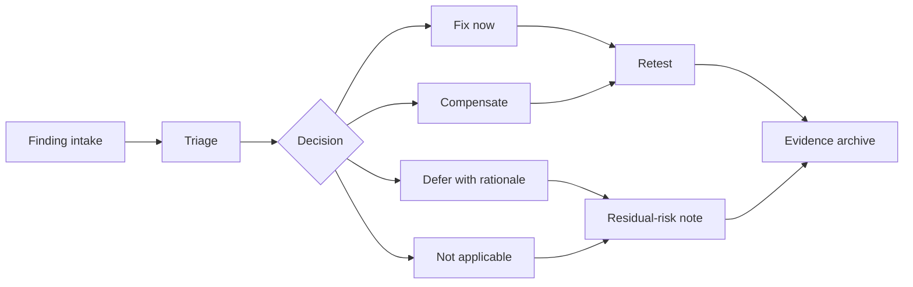

# CDE 2026 臨床端醫材 / 資訊系統資安要求 80 分鐘準備筆記

Purpose: convert the CYBERSEC / medical-cybersecurity source base into the confirmed CDE session for Prof. Wu.

Planning source of truth:

`../planning-everything-track/data/knowledge/personal/sources/2026-04-20-cde-prof-wu-clinical-medical-device-it-cybersecurity-speech/source.md`

## Confirmed Constraints

| Item | Detail |
| --- | --- |
| Event | `醫療器材網路/資訊安全法規簡介及實務分享` |
| Date | `2026-06-16` Tuesday |
| Venue | 財團法人張榮發基金會 `801` 會議室, 臺北市中山南路 `11` 號 `8` 樓 |
| Session | `14:50-16:20`, `臨床端對醫療器材/資訊系統之資安要求` |
| Speaker | 吳育德教授, 國立陽明交通大學 生醫光電研究所 |
| Working speaking time | About `80` minutes, leaving about `10` minutes for buffer / transition |
| Material deadline | `2026-06-08` Monday |
| Required material | Slide deck including Prof. Wu's CV; `3` pre/post-test questions with answers |
| Test-question rule | Questions should come from the handout so learners can find answers themselves |
| Administrative attachment | CDE authorization agreement is archived in the planning source bundle; CDE says a paper copy will be provided on the course day for signature |

## Transcript And Audio Production Decision

Recorded on `2026-05-26` from Jason's planning update:

- Prof. Wu wants the `1.5` hour CDE lecture prepared as a full transcript and
  as pre-recorded lecture audio.
- Jason's production target is about `80` minutes of speakable content, not the
  full `90` minutes, because the official session should preserve time for
  Q&A, transitions, and possible rest.
- Jason does not want to personally record the full talk. The preferred route
  is:
  1. write a clean slide-by-slide transcript first;
  2. keep the language in Taiwan-used Traditional Chinese with oral pacing;
  3. use `BreezyVoice 26` to convert the transcript into Taiwan Traditional
     Chinese speech audio;
  4. review the generated audio for pronunciation, pacing, English acronym,
     technical-term, and sensitive-content errors before handoff.

Production implication:

- This file should support a speakable transcript, not only slide bullets.
- Each retained slide needs a concise spoken paragraph that can survive TTS.
- English acronyms, company names, and cybersecurity terms should be written in
  a way that a Taiwan Mandarin TTS voice can pronounce acceptably, or marked
  for manual correction.

## First-Principles Frame

Scarce resource: the audience's ability to convert cybersecurity from abstract regulation into hospital-side acceptance, testing, repair, and governance decisions.

Canonical home:

- Event facts, deadline, schedule, and capacity: planning repo.
- Talk content, role split, slide story, rehearsal, and question drafting: this talk repo.

Core thesis:

`臨床端的資安要求不是多一份掃描報告，而是醫院能不能信任這個系統在真實部署、修補、異常與事件交接時仍然可被治理。`

Real talk objective:

`不是講得最完整，而是讓台下相信：這個團隊真的做過醫療資安落地。`

Audience promise:

By the end, electronic-industry and academic/research cross-domain participants should know:

- what hospitals actually ask from medical-device / information-system vendors;
- how white-box review, black-box testing, penetration testing, SBOM, and deployment review differ;
- how a finding moves from discovery to triage, owner, patch decision, retest, residual-risk note, and evidence archive;
- why cybersecurity governance is a patient-safety and clinical-continuity issue, not only an IT checklist.

## Hidden Strategic Objective

Although the official topic is medical-device / hospital cybersecurity education for TFDA / CDE audiences, this talk also functions as an industry credibility and relationship-building opportunity for the Wu-team / 智得灣 or 智德萬 service lane.

Source note:

- This strategic objective is not a CDE requirement.
- It is supported by the `2026-04-16` Prof. Wu / Tomi meeting record, where the medical-cybersecurity deck was framed as industry-facing, service-oriented, and meant to make listeners understand why they may need help executing cybersecurity work.
- Confirm the public-facing company spelling and logo before slides; existing planning notes contain both `智得灣` and `智德萬`.

Constraints:

- Must remain educational-first.
- Must not appear as direct marketing.
- Company capability exposure should happen indirectly through real deployment lessons, FDA / `510(k)` experience, practical cybersecurity failures, and operational workflows.
- The audience should infer capability from specificity: attack paths, evidence chains, finding repair, Patch SLA, retest, and hospital procurement logic.

Avoid:

- overt company sales pitch;
- excessive company logo placement;
- generic AI hype;
- abstract academic theory without operational linkage;
- checklist-style regulation reading;
- exploit-cookbook details;
- proprietary hospital, LINE, client, or patent-sensitive implementation details.

## Production Deck Design System

This is not an academic conference deck and not a normal classroom lecture. It is a medical-cybersecurity credibility talk.

FIRST PRINCIPLE:

- Scarce resource: audience trust and cognitive load, not maximum technical volume.
- Canonical content home: this talk repo owns narrative, slide writing, rehearsal, and question drafting; planning owns deadlines, capacity, status, and source locators.
- Production rule: every slide needs one core sentence; if a page cannot be reduced to one sentence, split it, rewrite it, or delete it.

Every slide must satisfy six constraints:

| Goal | Meaning |
| --- | --- |
| 聽得懂 | Non-cybersecurity audience members can follow the main point. |
| 有技術深度 | Engineers do not feel the talk is empty or hand-wavy. |
| 有臨床感 | Hospital-side listeners recognize the workflow pain. |
| 有法規感 | FDA / TFDA / RA / QA listeners recognize the lifecycle evidence logic. |
| 有 deployment 感 | The team looks like it has really deployed or supported systems. |
| 不像 sales pitch | 智得灣 / 智德萬 credibility is built indirectly, not by advertising. |

Do not use:

- dense bullet walls;
- long statutory text;
- full-page paragraphs;
- hacker stock photos;
- AI robot art;
- excessive CVE numbers;
- over-academic theory;
- government-bid-style slides.

Use:

- large architecture diagrams;
- attack chains;
- hospital workflows;
- lifecycle flows;
- trust boundaries;
- real deployment issues;
- one-slide-one-message pacing;
- large titles;
- clinical consequences.

Section color system:

| Section | Color |
| --- | --- |
| Clinical systems | Deep blue |
| Attack paths | Dark red |
| Governance | Orange |
| System / white-box | Deep green |
| FDA / lifecycle | Purple |

Font guidance:

- English: `Inter`, `Aptos`, or `Helvetica Neue`.
- Chinese: `Noto Sans TC` / `思源黑體`.

Default slide layout:

```text
[Title]

[One core diagram / one visual]

[3 short supporting points]

[Bottom takeaway sentence]
```

Avoid this layout:

```text
Title

- 15 bullet points
- 20 lines of text
- no visual
```

Production rule:

If a slide does not have one core sentence, it is probably not a slide yet. Split it, rewrite it, or delete it.

## No-Overlap Boundary

The first two talks already cover:

1. `醫療器材網路安全驗證要求與常見缺失`: verification-unit perspective.
2. `醫療器材網路安全之設計驗證經驗分享`: medical-device vendor / design-verification perspective.

This third talk should own:

- hospital / clinical-end requirements;
- procurement and acceptance evidence;
- deployment and operational constraints;
- penetration-testing interpretation from clinical exposure;
- white-box and system review as evidence inputs, not isolated tool demos;
- governance: finding ownership, Patch SLA, retest, residual-risk communication, and incident handoff.

Avoid:

- a second verification checklist lecture;
- a vendor case-study repeat;
- exploit cookbook details;
- private hospital / client / student / LINE cases;
- patent-sensitive implementation mechanics.

## 80-Minute Narrative Architecture

| Time | Owner | Story beat | Job |
| ---: | --- | --- | --- |
| `0-5` | Prof. Wu / shared | Why this talk exists | CV, clinical-side perspective, FDA / `510(k)` credibility signal, and separation from the previous two talks |
| `5-13` | Jason | What hospitals are afraid of | Ransomware, PACS/HIS disruption, legacy devices, vendor remote maintenance, patch immobility, and clinical continuity |
| `13-23` | Jason | Why FDA / TFDA pushed cybersecurity | Networked medical devices are networked computers; introduce SPDF, SBOM, vulnerability disclosure, threat modeling, and patch lifecycle as logic, not law-reading |
| `23-49` | Jason | Attack surface -> testing -> threat model | Hospital attack paths, medical IoT exposure, AD lateral movement, DICOM/HL7/API paths, VPN maintenance, finding anatomy, severity, and threat-model handoff |
| `49-63` | 靖中 | Outside-in is not enough | White-box review, secure coding/config, dependency/SBOM completeness, secrets, credentials, and root-cause prevention |
| `63-74` | 靖中 | System and deployment reality | Architecture, segmentation, PACS/HIS/EMR boundary, logging, monitoring, backup, recovery, and incident workflow |
| `74-76` | Shared | Case-like deployment lesson | Use one integrated evidence chain to show capability indirectly through practical diagnosis |
| `76-80` | Shared | Evidence map and close | Show one risk -> test -> fix -> evidence -> owner workflow and connect it to the three pre/post-test questions |

Buffer rule: if the session is running late, compress examples, not the evidence map or governance close.

## 45-Slide Production Skeleton

This is the production-level `80` minute version. The rule is one slide, one message. If a slide cannot be reduced to one core sentence, split it or delete it.

Legend:

- `Credibility`: indirect Wu-team / company capability placement; teach through operational specificity, not sales copy.
- `Keep light`: do not over-technicalize; use explanation, diagram, or clinical consequence instead of dense exploit detail.

| # | Slide | Owner | One-line message | Purpose | Visual suggestion | Speaker notes / caution | Flag |
| ---: | --- | --- | --- | --- | --- | --- | --- |
| 1 | Cover | Shared | Clinical cybersecurity is now part of clinical-system trust. | Establish official topic and clinical frame. | Hospital infrastructure / PACS-HIS topology / connected workflow; no hacker stock art. | Use the CDE title exactly: `臨床端對醫療器材 / 資訊系統之資安要求`. | Keep light |
| 2 | Speaker credibility | Prof. Wu / Shared | This team is speaking from medical-system and SaMD experience, not theory alone. | Build trust before technical content. | Clean CV strip: NYCU, biomedical optics, AI / medical systems, FDA `510(k)` experience. | Avoid product-logo clutter or company pitch. The goal is `他們真的做過`. | Credibility |
| 3 | Operational reality | Shared | Today is not a law-reading session; it is about how cybersecurity survives hospital deployment. | Set audience expectation. | Split screen: regulation-only vs deployment reality. | Name the three lenses: real attack surface, lifecycle security, deployment reality. | Keep light |
| 4 | Story map | Jason | The talk follows one chain from hospital fear to lifecycle evidence. | Give the audience a map. | Flow: Hospital Reality -> Why FDA Changed -> Real Attack Surface -> Testing & Governance -> White-box & System Design -> Lifecycle Evidence. | This tells listeners the deck has a spine, not a pile of topics. | Keep light |
| 5 | Why clinical environment is different | Shared | Hospitals are not ordinary enterprise IT because downtime can become clinical harm. | Bridge from opening into hospital reality. | Five icons: patient safety, downtime, continuity, legacy, vendor dependency. | This is the first contrast slide: office IT vs clinical environment. | Keep light |
| 6 | Hospitals are critical infrastructure | Jason | Ransomware can delay diagnosis, stop surgery, and affect treatment. | Build urgency. | Ransomware timeline from infection to service disruption. | Avoid sensationalism; emphasize care continuity. | Keep light |
| 7 | Hospital as system of systems | Jason | A hospital is a connected system of HIS, PACS, EMR, LIS, devices, staff, identity, and vendors. | Make the environment visible. | Large architecture diagram. | This is the first big picture of the attack surface. | Keep light |
| 8 | Hospital network diagram | Jason | Segmentation and trust boundaries decide whether one compromise becomes hospital-wide risk. | Create the reference diagram for later attack chains. | Network zones: clinical, admin, imaging, lab, vendor access, cloud / internet. | This page should be reused mentally for slides 22-29. | Keep light |
| 9 | Why hospitals cannot patch quickly | Jason | Patching in hospitals is not clicking update; it is a clinical and validation decision. | Explain why ordinary IT advice fails. | Patch decision funnel: vulnerability -> vendor approval -> validation -> downtime window -> deployment. | Mention validation, certification, vendor approval, compatibility, downtime. | Credibility |
| 10 | Legacy systems still exist | Jason | Medical-device lifecycles are much longer than consumer IT lifecycles. | Explain persistent vulnerable assets. | Old OS / embedded system lifecycle bar. | Avoid mocking hospitals; explain why replacement is hard. | Keep light |
| 11 | Vendor-controlled devices | Jason | Vendor remote access is a trust boundary. | Introduce third-party operational risk. | VPN -> hospital subnet diagram. | This will resonate with hospital IT and medical-device vendors. | Credibility |
| 12 | PACS downtime equals clinical delay | Jason | Imaging downtime can delay stroke, surgery, ER, and treatment decisions. | Convert cyber risk into clinical consequence. | PACS unavailable -> radiology delay -> clinical decision delay. | Do not stay abstract; use workflow consequence. | Keep light |
| 13 | Cybersecurity is patient safety | Jason | A cybersecurity failure can become patient harm. | Major transition into regulation. | IT risk -> clinical consequence diagram. | End Part 1 with this line, then ask why FDA/TFDA now care. | Keep light |
| 14 | Medical devices became networked computers | Jason | FDA changed because medical devices now connect, update, exchange data, and depend on software. | Begin regulatory logic. | Device evolution: standalone -> connected -> cloud / hospital-integrated. | Do not lead with regulation; lead with why regulation became necessary. | Keep light |
| 15 | Why FDA requirements expanded | Jason | Cybersecurity requirements expanded as devices moved from isolated tools to connected clinical infrastructure. | Give regulatory timeline. | Timeline: legacy device era -> connected device era -> ransomware era -> postmarket monitoring. | This can include FDA / TFDA milestones without turning into legal text. | Keep light |
| 16 | FDA 524B | Jason | FDA 524B asks manufacturers to plan secure updates, vulnerability handling, SBOM, and postmarket support. | Ground the talk in regulation. | Four blocks: secure update, vulnerability process, SBOM, postmarket support. | Do not read statutory language. Use operational translation. | Keep light |
| 17 | SPDF | Jason | Secure development means security is designed into the lifecycle, not patched at the end. | Introduce secure lifecycle thinking. | Lifecycle loop: requirements -> design -> implementation -> test -> release -> monitor. | Connect SPDF to engineering evidence. | Keep light |
| 18 | SBOM | Jason | SBOM is an ownership map, not just an inventory. | Make SBOM practical. | Component tree with owner / version / vulnerability / action columns. | Set up 靖中's later dependency ownership section. | Credibility |
| 19 | Coordinated vulnerability disclosure | Jason | Vulnerabilities need a receiving, triage, patch, notification, and retest process. | Explain postmarket responsibility. | Flow: receive -> triage -> patch -> notify -> retest. | This is governance, not PR language. | Credibility |
| 20 | Lifecycle evidence | Jason | FDA/TFDA wants an evidence chain, not verbal claims of being secure. | Transition into attack surface and testing. | Evidence chain: threat model -> test -> finding -> fix -> retest -> archive. | This is the conceptual bridge into Jason's main attack/testing section. | Keep light |
| 21 | Attack surface map | Jason | Healthcare attack surface spans identity, device, API, update, data, network, and vendor access. | Start Jason main section. | Large map with nodes and trust boundaries. | Use this as the index for attack paths. | Keep light |
| 22 | Phishing to HIS/PACS | Jason | Phishing is often the first step toward clinical-system disruption. | Show a familiar attack becoming clinical risk. | Chain: Email -> Workstation -> Credential theft -> AD -> File share -> PACS/HIS. | Keep it conceptual; no exploit steps. | Keep light |
| 23 | Vendor VPN attack path | Jason | Remote maintenance can become a privileged path into clinical networks. | Show a high-signal hospital risk. | Vendor VPN -> maintenance account -> device subnet -> operations impact. | This is an indirect credibility slide because it feels deployment-realistic. | Credibility |
| 24 | PACS / DICOM exposure | Jason | Imaging workflows have specialized protocols and trust assumptions that attackers can exploit. | Show medical-specific attack surface. | DICOM workflow: modality -> PACS -> viewer -> report. | Do not deep dive into DICOM exploit mechanics. | Keep light |
| 25 | HL7 / API integration risk | Jason | Every integration point is also a trust boundary. | Explain interface risk. | HIS/EMR/LIS/API/file ingestion trust-boundary diagram. | Tie validation and data trust to clinical workflow. | Keep light |
| 26 | Third-party component risk | Jason | A vulnerable component becomes a medical-device risk when no one owns the update path. | Place deployment credibility. | Dependency chain: vendor component -> product -> hospital deployment. | This is a strong 智得灣 / 智德萬 credibility placement: practical, not promotional. | Credibility |
| 27 | Update path weakness | Jason | Update infrastructure is a high-impact trust boundary. | Show why secure update matters. | Update server -> package -> device / hospital deployment. | Explain compromise consequence without attack recipe. | Keep light |
| 28 | Credential reuse | Jason | Credential reuse and flat networks turn small findings into lateral movement. | Explain how incidents expand. | Flat network lateral movement diagram. | Keep the message simple: identity plus segmentation matters. | Keep light |
| 29 | Medical IoT lateral movement | Jason | Connected devices are not isolated endpoints; they can become bridges. | Show IoMT risk. | Device subnet with arrows to workstation / server / PACS. | Avoid naming private systems. | Keep light |
| 30 | Clinical workflow is the attack surface | Jason | The real target is the connected care workflow, not a single device. | Major transition from attack paths to testing/governance. | Overlay attack paths on a clinical workflow. | This closes the attack-surface arc. | Keep light |
| 31 | Scan vs pentest vs black-box | Jason | Testing terms are different because they answer different trust questions. | Prevent vocabulary confusion. | Comparison table: scan / black-box / pentest / deployment review. | Very important for mixed industry audience. | Keep light |
| 32 | Anatomy of a finding | Jason | A useful finding tells a story: evidence, path, impact, owner, fix, and retest. | Show what real output looks like. | Finding card template. | This is service credibility through report quality. | Credibility |
| 33 | Severity depends on clinical context | Jason | CVSS is not enough when the impact is clinical workflow disruption. | Reframe risk priority. | Matrix: exploitability x exposure x clinical consequence. | Avoid arguing against CVSS; say it is insufficient alone. | Keep light |
| 34 | Threat modeling | Jason | Once we know assets, trust boundaries, attack paths, and clinical impact, we know what architecture must protect. | Jason handoff to 靖中. | Bridge diagram: asset -> boundary -> attack path -> clinical impact -> control. | End with: architecture must answer the risks we just saw. | Keep light |
| 35 | Why outside-in is not enough | 靖中 | Pentest shows exploitability; white-box review shows root cause and preventability. | Start 靖中 main section. | Outside-in vs inside-out split diagram. | This should feel like a clean baton pass. | Keep light |
| 36 | White-box review | 靖中 | White-box review finds issues while they are cheaper, traceable, and fixable. | Explain white-box value. | Source / config / dependency / logging quadrants. | Cover source, config, dependency, secrets, auth, input validation, logging. | Keep light |
| 37 | Secure coding and secure defaults | 靖中 | Many security failures come from ordinary defaults and missing checks, not exotic attacks. | Make secure coding concrete. | Before/after examples: role check, input validation, audit log, default config. | Use examples, not abstract principles. | Credibility |
| 38 | Dependency ownership and SBOM completeness | 靖中 | SBOM is only useful when every dependency has an owner and an update path. | Extend SBOM into engineering responsibility. | SBOM table with owner, version, CVE, action, deadline. | This connects to Jason slide 18 and 26. | Credibility |
| 39 | Secrets / credentials / config | 靖中 | Secrets, credentials, and config mistakes often decide whether systems are defensible. | Highlight practical failure class. | Config / secret lifecycle diagram. | Keep examples sanitized; no real secrets or private architecture. | Keep light |
| 40 | System architecture trust boundaries | 靖中 | Architecture defines where trust begins, ends, and must be verified. | Move from code to system design. | Trust-boundary architecture diagram. | This is 靖中's architecture anchor slide. | Keep light |
| 41 | Segmentation and deployment topology | 靖中 | A secure design can fail if deployment topology ignores network and operational boundaries. | Explain deployment reality. | Segmentation diagram: zones, firewall rules, service paths. | Engineering-heavy, but keep it diagram-first. | Keep light |
| 42 | Logging / monitoring / auditability | 靖中 | Without logs, there is no forensic evidence and no operational trust. | Explain observability as security evidence. | Log pipeline: event -> audit log -> alert -> investigation -> evidence. | Tie to hospital incident response and regulator-facing evidence. | Credibility |
| 43 | Backup / recovery / incident workflow | 靖中 | Prevention is not enough; recovery and incident workflow decide clinical resilience. | Add resilience, not only prevention. | Incident workflow: detect -> isolate -> recover -> validate -> communicate. | This is important because many talks forget recovery. | Credibility |
| 44 | Hospital integration reality | 靖中 | The hard part is PACS, HIS, EMR, and workflow integration, not the AI model alone. | 靖中 close. | Integration diagram: AI / device -> PACS / HIS / EMR -> clinical users. | End 靖中's section with deployment realism. | Credibility |
| 45 | Integrated evidence map | Shared | Lifecycle trust comes from connecting risk, threat model, testing, finding, fix, retest, and evidence. | Final synthesis and discussion bridge. | Vertical flow: Risk -> Threat model -> Testing -> Finding -> Fix -> Retest -> Evidence -> Lifecycle trust. | Close with three takeaways and connect to pre/post-test questions; do not hard-sell. | Credibility |

## 45-Slide Timing

| Time | Slides | Goal |
| ---: | ---: | --- |
| `0-7` min | `1-5` | Establish credibility, audience context, and the clinical-side boundary. |
| `7-20` min | `6-13` | Build urgency through hospital reality and patient-safety consequences. |
| `20-31` min | `14-20` | Explain why FDA / TFDA cybersecurity requirements follow from networked medical-device risk. |
| `31-47` min | `21-30` | Jason main section: make the real attack surface visible through attack chains. |
| `47-55` min | `31-34` | Jason close: clarify testing vocabulary, finding anatomy, clinical severity, and threat-model handoff. |
| `55-74` min | `35-44` | 靖中 main section: explain white-box, SBOM, secure coding/config, architecture, deployment, logging, recovery, and hospital integration. |
| `74-80` min | `45` | Integrated evidence map, three takeaways, pre/post-test bridge, and discussion. |

## 45-Slide Detailed Design And Writing Plan

Use this section when actually drafting the slides. It expands the production skeleton into page-level writing instructions.

### Slide 1 - Cover

- Title: `臨床端對醫療器材 / 資訊系統之資安要求`
- Subtitle: `Clinical Cybersecurity Requirements for Medical Devices and Healthcare Information Systems`
- Purpose: establish formality, medical context, infrastructure feeling, and cybersecurity topic without making the talk look like a hacker presentation.
- Visual: deep-blue background with hospital information-system silhouettes, PACS / HIS / EMR / connected-device nodes, or a subtle network overlay.
- Footer: CDE, TFDA, NYCU, date, Prof. Wu.
- Avoid: hoodie hacker, binary rain, skull, dramatic dark-web imagery.
- Speaker line: `今天不只是談 regulation，而是談醫院真正怎麼面對醫療系統與醫療器材的資安風險。`

### Slide 2 - Speaker And Team Credibility

- Title: `From Medical AI Development to Cybersecurity Practice`
- Purpose: establish `這群人真的做過`, not a pure regulatory lecture.
- Layout: left side for Prof. Wu, right side for team capability matrix.
- Left content: NYCU, 生醫光電, 醫療 AI / SaMD, clinical systems, FDA `510(k)` experience.
- Right content: medical software, clinical workflow, cybersecurity testing, deployment governance, regulatory evidence.
- Bottom line: `Experience from medical-device development, AI systems, deployment, and cybersecurity operations.`
- Credibility placement: possible soft reference to 智得灣 / 智德萬 or Wu-team experience, but do not turn it into a company brochure.
- Avoid: product catalog, `contact us`, sales channel, crowded logo wall.

### Slide 3 - This Talk Is About Operational Reality

- Title: `This Talk Is About Clinical Cybersecurity in Practice`
- Core message: cybersecurity requirements finally land in hospital operations, device deployment, maintenance workflow, and responsibility assignment.
- Layout: left/right contrast.
- Left: regulation-only view: statutes, checklist, document submission.
- Right: clinical operation view: clinical continuity, maintainable devices, traceable vulnerabilities, repair evidence, risk ownership.
- Bottom takeaway: `Medical cybersecurity now affects clinical continuity and patient safety.`
- Speaker line: `法規是起點，真正的挑戰是如何在醫院端落地。`

### Slide 4 - Today's Story Map

- Title: `Today's Story Map`
- Purpose: tell the audience this is one lifecycle story, not disconnected topics.
- Visual: horizontal journey: `醫院現實 -> FDA 為何改變 -> 攻擊面 -> 測試與治理 -> 白箱與系統設計 -> 證據鏈`.
- Node writing:
  - Hospital reality: 醫院不是普通 IT 環境.
  - Regulatory shift: 醫療器材已變成 connected systems.
  - Attack surface: 攻擊面存在於 workflow.
  - Testing: 測試要連到臨床衝擊.
  - Engineering: 系統設計要能防錯.
  - Evidence: 最後要留下可稽核證據.
- Speaker line: `今天不是零散 topic，而是一條完整 lifecycle。`

### Slide 5 - Where This Session Fits

- Title: `Where This Session Fits`
- Purpose: avoid overlap with the two earlier CDE talks.
- Visual: three-column table.
- Content:
  - 第一場 / 驗證單位 / 驗證要求與常見缺失.
  - 第二場 / 醫材業者 / 設計驗證經驗.
  - 第三場 / 臨床端 / 醫院部署、使用、維護與資安要求.
- Speaker line: `前兩場偏驗證與廠商設計，本場會從醫院端與臨床使用端看問題。`
- Writing caution: keep this brief; it is a positioning slide, not agenda bureaucracy.

### Slide 6 - Hospitals Are Critical Infrastructure

- Title: `Hospitals Are Critical Infrastructure`
- Core message: hospital cybersecurity incidents affect care continuity.
- Visual: event chain: `Ransomware -> PACS unavailable -> imaging delay -> treatment delay -> patient safety risk`.
- Supporting points: healthcare services cannot stop casually; unavailable data affects diagnosis; system delay becomes clinical delay.
- Speaker line: `真正問題不是檔案加密，而是醫療流程中斷。`

### Slide 7 - A Hospital Is A System Of Systems

- Title: `A Hospital Is a System of Systems`
- Purpose: let the audience see the real interconnected environment before attack paths appear.
- Visual: large architecture diagram with HIS, EMR, PACS, LIS, nurse station, radiology workstation, identity system / AD, vendor VPN, medical devices, cloud service, and clinical users.
- Bottom takeaway: `任何一個連接點，都可能成為風險傳遞路徑。`
- Design caution: do not make the diagram too technical; it must communicate interconnectedness at a glance.

### Slide 8 - Clinical Network Boundaries Matter

- Title: `Clinical Network Boundaries Matter`
- Purpose: create the reference map for later attack chains.
- Visual: zone diagram: Internet, DMZ, admin network, clinical network, imaging network, lab network, device subnet, vendor maintenance access.
- Highlight: trust boundaries with red dashed lines.
- Speaker line: `很多攻擊不是直接打醫材，而是先進入醫院 network，再橫向移動。`
- Credibility placement: this page should feel like it came from real deployment review.

### Slide 9 - Why "Just Patch It" Often Fails In Hospitals

- Title: `Why "Just Patch It" Often Fails in Hospitals`
- Core message: patching in hospitals is governance, not a button.
- Visual: four cards: clinical uptime, vendor validation, compatibility testing, regulatory / validation constraints.
- Supporting points: devices may support care now; updates may require vendor confirmation; HIS / PACS / device compatibility matters; downtime windows are limited.
- Bottom takeaway: `Patch 在醫院是一個治理流程，不是一個按鈕。`
- Speaker note: this is a high-resonance hospital-side slide.

### Slide 10 - Legacy Systems Are Still Part Of Clinical Reality

- Title: `Legacy Systems Are Still Part of Clinical Reality`
- Core message: medical-device lifecycle is often much longer than normal IT lifecycle.
- Visual: old workstation / embedded device plus medical-device lifecycle timeline.
- Supporting points: long device life, expired operating system, limited vendor support, replacement cost, clinical revalidation difficulty.
- Tone: do not blame hospitals; explain structural constraints.

### Slide 11 - Vendor Access Is A Trust Boundary

- Title: `Vendor Access Is a Trust Boundary`
- Core message: vendor remote maintenance is necessary but risky.
- Visual: `Vendor laptop -> VPN -> Hospital network -> Medical device subnet`.
- Supporting points: remote maintenance accounts, VPN privileges, shared credentials, outsourced operations, vendor endpoint risk.
- Bottom takeaway: `被信任的維護路徑，也可能成為攻擊路徑。`
- Credibility placement: this naturally signals deployment experience.

### Slide 12 - PACS Downtime Becomes Clinical Delay

- Title: `PACS Downtime Becomes Clinical Delay`
- Purpose: turn abstract cybersecurity into clinical scenario.
- Visual: patient -> CT / MRI -> PACS -> physician review -> diagnosis -> treatment.
- Supporting points: imaging unavailable, diagnosis delayed, surgery / ER workflows affected, workaround pressure on physicians.
- Speaker line: `這不是單純系統壞掉，而是診斷流程被迫中斷。`

### Slide 13 - Cybersecurity Is Patient Safety

- Title: `Cybersecurity Is Patient Safety`
- Purpose: first emotional anchor and transition to regulation.
- Visual: `IT failure -> Clinical workflow disruption -> Patient safety risk`.
- Supporting points: confidentiality protects records/images; integrity prevents unsafe data modification; availability keeps clinical systems usable.
- Bottom takeaway: `醫療資安的終點，是照護不中斷。`

### Slide 14 - Medical Devices Became Networked Computers

- Title: `Medical Devices Became Networked Computers`
- Purpose: explain why FDA / TFDA cybersecurity requirements became inevitable.
- Visual: timeline: standalone device -> networked device -> cloud-connected device -> AI-enabled SaMD.
- Supporting points: connected, updatable, data-exchanging, remotely maintained, integrated with hospital systems.
- Speaker line: `FDA / TFDA 開始重視 cybersecurity，是因為醫材已經不再只是單機設備。`

### Slide 15 - Why FDA Cybersecurity Requirements Expanded

- Title: `Why FDA Cybersecurity Requirements Expanded`
- Visual: four drivers around FDA: ransomware threat, connected devices, third-party components, postmarket vulnerabilities.
- Core message: FDA cares about the full product lifecycle, not just one premarket test.
- Writing caution: no legal-wall text; use risk logic.

### Slide 16 - FDA 524B In Plain Language

- Title: `FDA 524B in Plain Language`
- Purpose: introduce the regulation without reading the statute.
- Visual: four blocks: secure updates, SBOM, vulnerability disclosure, postmarket support.
- Writing approach: each block gets one operational sentence.
- Example sentence: `產品上市後，仍需有能力處理新發現的弱點。`
- Speaker line: `FDA 已經把 cybersecurity 視為 product lifecycle 問題。`

### Slide 17 - Secure Product Development Framework

- Title: `Secure Product Development Framework`
- Purpose: place cybersecurity inside development flow.
- Visual: lifecycle loop: design -> threat model -> implement -> test -> release -> monitor -> patch -> retest.
- Supporting points: security cannot be added only at the end; testing must map to risk; patching needs process; evidence must remain traceable.

### Slide 18 - SBOM Is A Map Of Responsibility

- Title: `SBOM Is a Map of Responsibility`
- Core message: SBOM is not just a definition or inventory.
- Visual: dependency tree: product -> library A -> library B -> container base image -> OS package.
- Supporting points: what components are used; which components have vulnerabilities; who tracks them; who repairs them; what compensating controls are used when repair is not possible.
- Speaker line: `真正問題不是有沒有 SBOM，而是出了漏洞之後誰負責。`
- Credibility placement: this is a practical industry pain point.

### Slide 19 - Coordinated Vulnerability Disclosure

- Title: `Coordinated Vulnerability Disclosure`
- Purpose: explain postmarket vulnerability-handling workflow.
- Visual: report -> validate -> risk assess -> fix -> notify -> retest -> archive.
- Supporting points: receive report; validate authenticity; assess clinical impact; decide fix; notify users; preserve evidence.
- Tone: governance workflow, not PR statement.

### Slide 20 - Regulators And Hospitals Need Evidence

- Title: `Regulators and Hospitals Need Evidence`
- Purpose: transition from FDA lifecycle to attack surface and testing.
- Visual: evidence chain: design evidence -> testing evidence -> deployment evidence -> patch evidence -> retest evidence.
- Bottom takeaway: `信任不是口頭承諾，而是可被檢查的證據鏈。`

### Slide 21 - Clinical Attack Surface Map

- Title: `Clinical Attack Surface Map`
- Purpose: formally start Jason's main section.
- Visual: clinical workflow in the center; attack surfaces around it: identity, workstation, network, vendor VPN, PACS, DICOM, HL7 / API, update server, third-party dependency, medical IoT.
- Core message: attack surface is not a single device; it is data, accounts, network, maintenance, and update workflow.
- Speaker line: `真正 attack surface 是整個 workflow。`

### Slide 22 - Attack Path 1: Phishing To Clinical Systems

- Title: `Attack Path 1: Phishing to Clinical Systems`
- Visual: red chain: phishing email -> workstation -> credential theft -> AD access -> lateral movement -> HIS / PACS disruption.
- Supporting points: initial entry may be ordinary; downstream impact may be clinical; lateral movement matters in healthcare.
- Speaker line: `醫療系統的風險常常不是從醫療設備開始，而是從一般工作站開始。`
- Caution: no exploit steps.

### Slide 23 - Attack Path 2: Vendor VPN To Device Subnet

- Title: `Attack Path 2: Vendor VPN to Device Subnet`
- Visual: vendor -> VPN -> privileged access -> device subnet -> medical-device disruption.
- Supporting points: vendor access needs least privilege; maintenance accounts need auditability; connection scope must be limited; sessions should be logged.
- Bottom takeaway: `遠端維護是必要功能，也是高風險入口。`
- Credibility placement: very strong; this feels like real hospital deployment.

### Slide 24 - Attack Path 3: PACS And DICOM Exposure

- Title: `Attack Path 3: PACS and DICOM Exposure`
- Visual: radiology modality -> DICOM router -> PACS -> viewer -> EMR.
- Supporting points: imaging systems are high value; DICOM workflows often include trust assumptions; image data is large and sensitive; downtime has high clinical impact.
- Caution: do not over-explain DICOM exploit mechanics.

### Slide 25 - Integration Interfaces Are Trust Boundaries

- Title: `Integration Interfaces Are Trust Boundaries`
- Visual: HIS / LIS / EMR / third-party systems with data-flow arrows.
- Supporting points: integration is not security; input validation must be explicit; API permissions need layering; file ingestion must validate format and source.
- Core message: interoperability creates new trust boundaries.

### Slide 26 - Third-Party Components Become Medical Risk

- Title: `Third-Party Components Become Medical Risk`
- Visual: stack: app -> framework -> package -> container -> OS -> hardware.
- Supporting points: risk may come from external libraries; transitive dependencies require tracking; container base images carry risk; vendor components require responsibility split.
- Speaker line: `很多風險不是自己寫的 code，而是第三方 component。`
- Credibility placement: use `實務上常看到 component ownership 不清楚` as a soft experience line.

### Slide 27 - Attack Path 4: Update Path As A High-Impact Boundary

- Title: `Attack Path 4: Update Path as a High-Impact Boundary`
- Visual: update server -> package signing -> device update -> deployment.
- Supporting points: update-server compromise can affect many devices; package integrity must be verified; rollback plan must exist; update logs must be traceable.
- Caution: explain consequence, not attack recipe.

### Slide 28 - Weak Credentials Plus Flat Network Equals Lateral Movement

- Title: `Weak Credentials + Flat Network = Lateral Movement`
- Visual: one account moving across multiple systems.
- Supporting points: shared admin account, reused password, weak segmentation, over-privileged service account.
- Bottom takeaway: `一個弱帳號，可能變成整個臨床網路的入口。`

### Slide 29 - Connected Devices Can Become Bridges

- Title: `Connected Devices Can Become Bridges`
- Visual: IoMT device as bridge between device subnet and hospital systems.
- Supporting points: a device is not only an endpoint; it may connect to cloud, vendor, and internal data flows.
- Caution: stay conceptual and avoid naming private systems.

### Slide 30 - Clinical Workflow Is The Attack Surface

- Title: `Clinical Workflow Is the Attack Surface`
- Purpose: summarize Jason's attack-chain section.
- Visual: patient registration -> imaging -> diagnosis -> treatment -> reporting -> follow-up, with attack paths overlaid.
- Supporting points: attack surface follows patient workflow, data workflow, identity workflow, and maintenance workflow.
- Bottom takeaway: `資安保護的不是單一設備，而是整個 connected care workflow。`

### Slide 31 - Scan, Black-Box Test, And Penetration Test Are Different

- Title: `Scan, Black-box Test, and Penetration Test Are Different`
- Visual: three-column comparison table.
- Content:
  - Vulnerability scan: finds known vulnerabilities and exposure; cannot prove realistic attack path.
  - Black-box test: sees externally visible behavior; cannot explain internal root cause.
  - Penetration test: validates exploitability and attack chain; cannot replace all code / system assurance.
- Speaker line: `測試方法不同，證明力也不同。`

### Slide 32 - Anatomy Of A Useful Security Finding

- Title: `Anatomy of a Useful Security Finding`
- Purpose: show what a useful report artifact looks like.
- Visual: finding report mockup.
- Fields: asset, entry point, evidence, attack path, clinical impact, severity rationale, owner, recommended fix, retest result, residual risk.
- Bottom takeaway: `好的 finding 不是只有漏洞名稱，而是能推動修補。`
- Credibility placement: report quality quietly sells service capability.

### Slide 33 - Severity Depends On Clinical Context

- Title: `Severity Depends on Clinical Context`
- Visual: same vulnerability in two contexts: administrative test system vs ER PACS viewer.
- Supporting points: CVSS is a starting point; exposure matters; clinical impact matters more; exploitability must be interpreted in context.
- Core message: same technical bug can have different medical risk.

### Slide 34 - Threat Modeling Connects Risk To Engineering

- Title: `Threat Modeling Connects Risk to Engineering`
- Purpose: Jason section close and handoff to 靖中.
- Visual: asset -> threat actor -> attack path -> clinical impact -> security control -> test plan.
- Supporting points: define what to protect; identify who may attack; map how they enter; decide how to defend; arrange testing.
- Handoff line: `當我們知道 attack path，下一步就是看系統設計能不能支撐防護。`

### Slide 35 - Why Outside-In Testing Is Not Enough

- Title: `Why Outside-In Testing Is Not Enough`
- Purpose: start 靖中's main section.
- Visual: outside perspective vs inside perspective.
- Outside: visible endpoints, exposed services, exploit path.
- Inside: code, config, dependency, architecture, secrets, logging.
- Core sentence: `Pentest 能證明可被利用，white-box review 能看見為什麼會發生。`

### Slide 36 - White-Box Review Scope

- Title: `White-box Review Scope`
- Visual: six blocks: source code, authentication, authorization, input validation, logging, configuration.
- Writing:
  - auth: 誰可以進來.
  - authorization: 進來後能做什麼.
  - input validation: 外部資料怎麼被處理.
  - logging: 事後能不能查.
  - config: 預設值是否安全.
- Purpose: define white-box scope without turning into a tool demo.

### Slide 37 - Secure Defaults Reduce Deployment Risk

- Title: `Secure Defaults Reduce Deployment Risk`
- Visual: bad default vs secure default.
- Bad examples: default password, debug mode enabled, excessive permissions, no audit log.
- Secure examples: forced password change, least privilege, secure logging, explicit role checks.
- Writing caution: use examples, not abstract secure-coding doctrine.

### Slide 38 - SBOM Completeness Enables Vulnerability Response

- Title: `SBOM Completeness Enables Vulnerability Response`
- Visual: dependency tree with ownership labels.
- Supporting points: direct dependency, transitive dependency, container layer, OS package, vendor binary.
- Bottom takeaway: `不知道自己用了什麼，就無法知道該修什麼。`

### Slide 39 - Secrets And Configuration Are Common Failure Points

- Title: `Secrets and Configuration Are Common Failure Points`
- Visual: three risk cards: hardcoded secrets, shared credentials, misconfigured deployment.
- Supporting points: secrets should not enter repo; production config must be separated; privileges must be minimized; credential rotation needs a process.
- Caution: sanitize examples; never show real secrets, real client config, or private architecture.

### Slide 40 - Architecture Review Starts With Trust Boundaries

- Title: `Architecture Review Starts with Trust Boundaries`
- Visual: system architecture with user boundary, hospital network boundary, vendor boundary, cloud boundary, database boundary, update boundary.
- Supporting points: which data crosses boundaries; which accounts cross boundaries; which services can be externally called; which components are highly trusted.
- Purpose: move from code evidence to system assurance.

### Slide 41 - Segmentation Limits Blast Radius

- Title: `Segmentation Limits Blast Radius`
- Visual: side-by-side flat network vs segmented network.
- Supporting points: separate clinical and admin systems; restrict device subnet communication; limit vendor access scope; put monitoring at critical boundaries.
- Tone: engineering-heavy but diagram-first.

### Slide 42 - No Logs, No Evidence

- Title: `No Logs, No Evidence`
- Visual: login -> API call -> data access -> configuration change -> alert -> investigation.
- Supporting points: logs must record who did what; logs must be retained; logs must be searchable; alerts must map to events; audit trail supports regulation and incident investigation.
- Credibility placement: strong operational maturity signal.

### Slide 43 - Resilience Is Part Of Cybersecurity

- Title: `Resilience Is Part of Cybersecurity`
- Visual: detect -> contain -> recover -> validate -> resume clinical service.
- Supporting points: backup must be restorable; recovery time must match clinical needs; incident owner must be known; downtime procedure must exist; recovery should be retested.
- Core message: prevention is not enough.

### Slide 44 - The Hard Part Is Integration

- Title: `The Hard Part Is Integration`
- Purpose: 靖中 section close.
- Visual: AI / SaMD system connected to HIS, EMR, PACS, vendor cloud, identity system, clinical users.
- Supporting points: AI model is not the whole product; integration determines risk; workflow determines usability; deployment boundary determines security responsibility; evidence determines trust.
- Speaker line: `真正的醫療資安，不只看系統有沒有功能，也看系統如何被部署、維護、監控與修補。`

### Slide 45 - From Risk To Lifecycle Trust

- Title: `From Risk to Lifecycle Trust`
- Purpose: final synthesis and discussion bridge.
- Visual: risk -> threat model -> test -> finding -> fix -> retest -> evidence -> lifecycle trust.
- Three takeaways:
  1. 醫療資安是 patient safety 問題.
  2. 測試要連到臨床情境與治理流程.
  3. 系統設計、白箱檢查與證據鏈，決定產品能否長期被信任.
- Closing line: `法規要求只是最低標準，真正的目標是讓醫療系統在真實環境中安全、可維護、可追溯。`
- Final caution: do not hard-sell; let the evidence-chain clarity build credibility.

## Final Slide-Building Advice

This `45` slide plan can support `80` minutes, but only if each page protects one core message. Do not chase maximum technical density. The goal is for the audience to believe the team has really done this work.

High-priority words:

- clinical workflow;
- operational pain;
- lifecycle;
- deployment;
- ownership;
- evidence.

Lower-priority distractions:

- fancy exploits;
- long CVE lists;
- AI buzzwords;
- dense legal text.

Recommended production rhythm:

- slides `1-20`: medical context and FDA / TFDA lifecycle logic;
- slides `21-34`: Jason on attack surface, penetration testing, clinical severity, and threat-model handoff;
- slides `35-44`: 靖中 on white-box, system design, deployment, monitoring, recovery, and integration;
- slide `45`: shared lifecycle evidence framework and discussion.

## Jason's 40-Minute Content Spine

### 1. Clinical-End Threat Model

Say this early:

`醫院端不是只問你的產品有沒有掃描過，而是問這個系統進到院內以後，誰能看見風險、誰能修、修多久、修完怎麼證明。`

Core points:

- Clinical continuity: cybersecurity incident can disrupt care, workflow, imaging, reporting, or device availability.
- Product scale changes evidence burden: model-only evidence is different from connected system evidence.
- Procurement evidence should be decision-usable: architecture, SBOM, threat model, test report, patch process, residual-risk language.

Hospital pain examples:

- ransomware causes outpatient / inpatient workflow disruption;
- PACS or imaging workflow outage blocks diagnosis and reporting;
- MRI, connected device, workstation, or vendor appliance becomes a lateral-movement bridge;
- legacy Windows / unsupported device cannot be patched on a normal IT schedule;
- vendor remote maintenance creates a privileged external trust path;
- hospital patch windows are constrained by clinical operation, validation, and vendor support.

Regulatory logic:

`FDA / TFDA 開始要求 cybersecurity，不是因為條文突然變多，而是醫材已經變成會連網、會更新、會和醫院系統交換資料的 computer。`

### 2. Penetration Testing / Black-Box Exposure

Frame:

`滲透測試不是找紅字，而是模擬一條攻擊路徑，確認這條路徑是否能造成臨床或營運上的重要影響。`

Explain:

- Black-box test: what is visible without internal access.
- Penetration test: realistic chain from entry point to impact.
- Medical context changes priority: the same technical bug can matter more if it blocks clinical workflow, leaks sensitive data, or enables unsafe configuration change.
- Useful report outputs: attack path, affected asset, clinical / operational impact, reproducible evidence, immediate mitigation, final fix, retest proof.

Concrete attack-path menu:

- phishing -> workstation -> AD / file share -> HIS / PACS access;
- VPN / remote maintenance -> vendor account -> device subnet;
- exposed web/API endpoint -> weak auth -> patient data or admin action;
- DICOM / HL7 / file ingestion -> parser / workflow abuse;
- vulnerable third-party package -> application compromise;
- update server / update package weakness -> unsafe deployment path.

Avoid:

- step-by-step exploit recipe;
- live attack detail;
- named private systems.

### 3. Governance After Findings

Frame:

`沒有 decision，就沒有治理；沒有證據，就沒有信任。`

Finding journey:



Governance checklist:

- owner assigned;
- severity and clinical context recorded;
- decision made: fix, compensate, defer, accept / not applicable;
- timeline / Patch SLA stated;
- hospital communication path known;
- retest evidence stored;
- residual risk written in language the clinical owner can understand.

Strategic placement:

- Do not say `智得灣 / 智德萬 可以賣你這個服務` as a hard pitch.
- Instead, show that each finding needs a real execution workflow: who finds it, who understands the clinical impact, who repairs it, who verifies it, and who can explain it to hospital / regulator stakeholders.
- Capability should be demonstrated by how concrete the workflow is.

## 靖中's 40-Minute Content Spine

### 1. White-Box Testing

Frame:

`白箱測試的價值，是在 release 前用比較便宜、比較可修、比較可追溯的方法，把問題提早看見。`

Core areas:

- source code review;
- configuration review;
- dependency and SBOM review;
- secrets handling;
- authentication / authorization;
- input validation and file handling;
- logging and auditability;
- secure default configuration.

### 2. System / Deployment Review

Frame:

`醫院端看到的不是一段 code，而是一個部署後會連到帳號、網路、資料、更新與維運流程的系統。`

Core areas:

- trust boundaries and data flow;
- role / account model;
- PACS / HIS / EMR integration boundary;
- network segmentation and firewall assumptions;
- update / rollback path;
- backup and recovery expectation;
- monitoring and incident handoff;
- what the vendor must document before hospital deployment.

### 3. Evidence Integration

靖中's close should connect back to Jason's governance section:

- white-box output becomes fix evidence;
- system review becomes deployment evidence;
- SBOM becomes component / vulnerability evidence;
- logs and audit become operational evidence;
- retest closes the loop.

## Draft Pre/Post-Test Questions

These are draft questions for CDE delivery. Keep the wording easy enough that learners can answer from the handout.

### Q1

醫院端評估醫療器材 / 資訊系統的資安時，最重要的不是只看到哪一種資料？

A. 一份沒有修補決策的掃描報告
B. 可追溯的風險、控制、測試、修補、重測與證據鏈
C. 只有模型準確率
D. 只有產品行銷簡介

Answer: B.

### Q2

白箱測試與滲透測試的主要差異，下列何者最接近本講義的說法？

A. 白箱測試只給法規看，滲透測試只給工程師看
B. 白箱測試從內部程式 / 設定 / 相依套件找可修問題；滲透測試從攻擊者視角驗證外部可達攻擊路徑與影響
C. 兩者完全一樣，只是工具名稱不同
D. 滲透測試可以取代所有後續修補與治理

Answer: B.

### Q3

當醫療器材 / 資訊系統發現高風險資安 finding 後，較完整的治理流程應該包含什麼？

A. 先記錄 owner、風險判斷、修補或補償決策、時程、重測證據與殘餘風險說明
B. 只把 finding 放進簡報，等客戶問再處理
C. 只要工具顯示通過，就不需要保存證據
D. 不需要與醫院端說明任何影響

Answer: A.

## Workback Plan

| Date | Output |
| --- | --- |
| `2026-05-22` | Jason / 靖中 agree on slide split, no-overlap boundary, and integrated evidence table |
| `2026-05-29` | Rough slides complete for both halves |
| `2026-06-03` | CV slide and `3` pre/post-test questions complete |
| `2026-06-05` | Integrated review copy ready for Prof. Wu / 靖中 timing check |
| `2026-06-08` | Final deck and questions sent to CDE |
| `2026-06-15` | Rehearsal and backup copy ready |
| `2026-06-16` | Session support / delivery |

## Open Questions

- Who has the latest Prof. Wu CV slide or preferred CV wording?
- Does 靖中 already have a white-box / system-testing deck segment, or should this file seed his slides?
- Should the deck use the existing `Designing-Cybersecurity-in-Regulated-Environments-for-ProfWu(2).pptx` as the editable base?
- Does CDE want PowerPoint, PDF, or both by `2026-06-08`?
- Should the three pre/post-test questions be submitted as a separate Word file, email body, or inside the slide deck?
